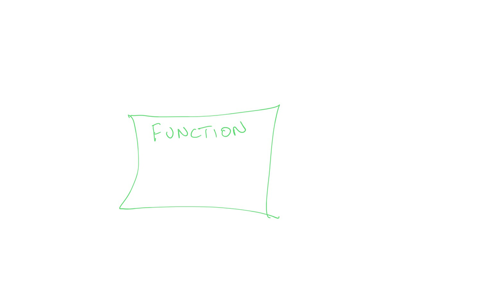

# 017 Functions in Python

## Introduction

### Purpose

In this session, we will learn about Functions in Python. In essence, a function allows us to write better, more compact and re-usable code. This is a concept we will use a lot in later sessions, so make sure you fully familiarise yourself with the material.

We will also briefly cover some special types of function: `map()`, `reduce()` and `lambda` functions.


### Prerequisites

You will need some understanding of the following:

* [001 Using Notebooks](001_Notebook_use.md)
* [003 Getting help](003_Help.md)
* [010 Variables, comments and print()](010_Python_Introduction.md)
* [011 Data types](011_Python_data_types.md) 
* [012 String formatting](012_Python_strings.md)
* [013_Python_string_methods](013_Python_string_methods.md)
* [014_Python_groups](014_Python_groups.md)
* [015_Python_control](015_Python_control.md)
* [016_Python_for](016_Python_for.md)

In particular, you will need to recall how to use:

   - [`assert`](016_Python_for.md#looping-over-dictionaries,-and-assert)
   - [`str.join()`](013_Python_string_methods.md#split()-and-join())
   - [`zip`](014_Python_groups.md#dict)


## Introduction to Functions

A [function](https://docs.python.org/3/glossary.html#term-function) is a block of code statements that we can use to carry out a specific purpose. 


The simplest form of function has no inputs or outputs, but simply performs some task when we call it:




An example of a simple function in Python is:


```python
def hello_world():
    '''print the string 'hello world'''
    print('hello world')
```

This is designed to print the string `hello world` when we call it.

Notice the formatting here: the function is declared:

    def hello_world():

and the *contents* of the function are indented in (by 4 spaces here).

We use the function in Python code as:


```python
hello_world()
```

    hello world


and access the function document string by:


```python
help(hello_world)
```

    Help on function hello_world in module __main__:
    
    hello_world()
        print the string 'hello world
    


### Exercise 1

* in a new code cell below, write a function called `my_name` that prints your name
* demonstrate that your code works (i.e. run it in a code cell)
* show the doc string using `help()` 

**Advice**: make sure it has an appropriate document string, based on the example in the notes, and also check that you have the indentation correct for the code in the function. Notice the semicolon `:` at the end of the `def` statement.

## Function specification


More generally, we could think of the the function as **a sort of filter**: it takes some **inputs** (specified in the arguments), makes some calculation based on these, i.e. that is a *function* of these inputs, and returns an **output**.


In this sense:

 * It will generally have one or more [arguments](https://docs.python.org/3/glossary.html#argument): `(arg1, arg2, ...)` that form the **inputs**.
 * It will often return some value (or set of values) as the **output**: `retval`
 * It will have a name: `my_function`


### Anatomy of a function

The format of a function in Python is:

    def my_function(arg1,arg2,...):
      '''
      Document string 
      '''

      # comments

      retval =  ... 

      # return
      return retval
      
The keyword `def` defines a function, followed by the function name, a list (actually, a [`tuple`](https://docs.python.org/3/library/stdtypes.html?highlight=tuple#tuple)) of arguments, then a semicolon `:`.

The contents of the function are indented to a consistent level of spaces.

The function will typically have a document string, generally a multi-line string defined within triple quotes. We use this to document information about the function, such as its author, purpose, and inputs and outputs.

Within the function, we can refer to the arguments (`arg1` and `arg2` here, though they will generally have more meaningful names), make some calculation based on these, and generally, return some value (`retval` here).

### Code design 

This idea of a *filter* can be useful when thinking how to design a function. We can see that we need to define:

    * purpose
    * inputs
    * output

Let's suppose we need to design a function that will take a first name and last name, and combine them into your full name (assuming for now that you have two names).

The *purpose* of our function could be stated as:

    generate a name string from list of strings
        
According to [PEP0257](https://peps.python.org/pep-0257/) this should be a single line to describe the purpose **as the first line in the comment block**. If needed, more information can be given below in a comment block.
    
The inputs could be:

    inputs:
      - name_list : list of names
      
And the output:

    return:
      - the full name
      
Without knowing any real coding then, we could develop the template for this function, along with an initial document string. 

We do need to give the function a name, so let's use `full_name` here.

We have started with the idea of some purpose for our code, then defined what the expected inputs and outputs would be. We can call coding at that level of generalisation [pseudocode](https://en.wikipedia.org/wiki/Pseudocode). We could have written our task is a form of pseudocode such as:

    algorithm full_name is
        input: List of strings in variable name_list
        output: string in variable retval

        purpose: generate a name string from list of strings 
        
        # CODE BLOCK to achieve aim (NOT DONE)
        # test by passing input to output
        retval = name_list
        
 where we have left the `CODE BLOCK` blank at the moment, and replaced it by simply sending the function input to the output so we can test the code structure. It can be of value when designing codes to first develop some pseudocode such as above, but in reality such statements are very closely related to what we would write in high-level codes like Python:


```python
def full_name(name_list):
    '''generate a name string from list of strings 

    inputs:
    - name_list : list of names

    return:
    - the full name
    '''
    # CODE BLOCK to achieve aim (NOT DONE)
    # test by passing input to output
    retval = name_list

    # return
    return retval
```

That's a good start, and it allows us to develop a function that we can run and test. 

To test, we can set a list of example strings. We then *call* the function `full_name()` with this argument, and set the value returned in the variable `full`.


```python
names = ['Fred','Bloggs']

full = full_name(names)
print(full)
```

    ['Fred', 'Bloggs']


From our test, we can see that the function doesn't yet achieve what we wanted: it simply returns the input list, rather than the full name.

To proceed, we need to know how to make a combined string. It can be useful to test our understanding of the code we will need to achieve the aim of the function. We do not need to do that inside the function, but can instead try to think of some examples we could use to test the ideas.

One way to achieve the aim of the function this would be to use the string [`join`](https://docs.python.org/3/library/stdtypes.html#str.join) operation that we came across the in [Python string methods](013_Python_string_methods.md#split()-and-join()) notes.

This works by placing a key string between string items in a list. For example, if we want to separate strings by `:`, we would use:

    ':'.join(names)


```python
':'.join(names)
```


    'Fred:Bloggs'


In our function, we want to use a single 'whitespace' value, so `' '` as the key:


```python
' '.join(names)
```


    'Fred Bloggs'


Now we are sure of the coding concept to achieve what we want in the filter, we can write the function:


```python
def full_name(name_list):
    '''generate a name string from list of strings 

    inputs:
    - name_list : list of names

    return:
    - the full name
    '''
    # join the names in name_list together
    retval = ' '.join(name_list)

    # return
    return retval
```

we try to make the docstring useful and test what it shows:


```python
help(full_name)
```

    Help on function full_name in module __main__:
    
    full_name(name_list)
        generate a name string from list of strings 
        
        inputs:
        - name_list : list of names
        
        return:
        - the full name
    


then run our code:


```python
full = full_name(['Fred','Bloggs'])
print(full)
```

    Fred Bloggs


## Test 

It is a good idea if we can write a test for our function. This should cover some typical case or cases, and check that we get the correct output for a particular input. We can use the [assert](https://www.w3schools.com/python/ref_keyword_assert.asp) method that we have seen in the [Python for](016_Python_for.md#looping-over-dictionaries,-and-assert) notes:

    assert True

For example:


```python
assert full_name(['Fred','Bloggs']) == "Fred Bloggs"
print('test passed')
```

    test passed


remember that if this assertion fails, we get an `AssertionError` (you can try that out by putting something incorrect in the assertion above and re-running the cell). If the error is raised, our code will strop running and report the error.  

We will learn more about code testing later, but for the moment, we suggest that you use one or more `assert` statements that try out different inputs-output matches with your function. 

### Exercise 2

We assume for this exercise that you know how to create a dictionary from two lists of the same length. This was covered in the [Python_Groups](014_Python_groups.md#dict) notes.

In this exercise, we suggest that you follow the design approach we took above:

- Think first what you will use as inputs and outputs to the function, and come up with some examples of inputs and outputs
- Then consider the Python code you would need to go from the inputs to the outputs
    * Develop and test the core code to achieve the function purpose in a notebook cell with an example input
    * Consider what you might use as a test for your code
- Develop skeleton
    * Write a skeleton function defining the purpose, inputs and outputs. In the skeleton code, you can just pass the inputs straight to the outputs. 
    * Confirm that that works before going further.
    * Confirm that your document string is useful.
    * Write a test
- Implement the core code in the function 
    * Confirm that that works
    * Confirm that your document string is useful.
    * Write a test
- Consider any flaws in your code and how you might improve it

**Your task for the exercise is:**

* design a function to convert two lists of the same length into a dictionary
* the design must include relevant comments, document strings and tests

## More on arguments

Python functions can take [two types of arguments](https://book.pythontips.com/en/latest/args_and_kwargs.html):

* positional arguments
* keyword arguments

### Positional arguments

The arguments we have used above are positional arguments, in that their definition in the function depends on the order they are specified in. For example:


```python
def hello(s1,s2):
    '''print out positional arguments
      
    Inputs:
      s1 : first argument
      s2 : secopnd argument
    '''
    print(f'argument 0 is {s1}')
    print(f'argument 1 is {s2}')
    
hello('hello','world')
```

    argument 0 is hello
    argument 1 is world


Sometimes in Python documentation, you will see the arguments specified simply as:

    example(*args, **kwargs)
    
This is the most general way of specifying function arguments. The first item in this case `*args` are the positional arguments. Although we generally specify them explicitly as above, we can also use

    *args
    
to specify them, where `args` is a list-like object. In this form, the example above becomes:


```python
def hello(*args):
    '''
    print out positional arguments
    
    Inputs:
        *args : list of positional arguments
    '''
    # loop over the list
    for i,s in enumerate(args):
        print(f'argument {i} is {s}')
    
hello('hello','world','again')
```

    argument 0 is hello
    argument 1 is world
    argument 2 is again


```python
# or using *args where args is a list
l = ['hello','world','again','as','list']
hello(*l)
```

    argument 0 is hello
    argument 1 is world
    argument 2 is again
    argument 3 is as
    argument 4 is list


In this example, we have not specified how many positional arguments there are, but obviously we need to attach some meaning to each of them in the order supplied. Sometimes this is useful in code, where we just want to loop over a list of arguments, but you should mostly be wary about using it unless you really need to. 

A good example of the use of `*args` is the `print()` statement. It will print out however many positional arguments we specify:


```python
print('hello','world','again')

l = ['hello','world','again','as','list']
# print the list, specifying l as a single positional argument
print(l)
# print the list passing each list item as a positional argument
print(*l)
```

    hello world again
    ['hello', 'world', 'again', 'as', 'list']
    hello world again as list


### Keyword arguments

The second type of argument we mentioned above was keyword arguments. These are typically used to modify the behaviour of a function are are of the form:

    verbose=True
    sep=' '


We can see examples of these with the `print` function:


```python
help(print)
```

    Help on built-in function print in module builtins:
    
    print(...)
        print(value, ..., sep=' ', end='\n', file=sys.stdout, flush=False)
        
        Prints the values to a stream, or to sys.stdout by default.
        Optional keyword arguments:
        file:  a file-like object (stream); defaults to the current sys.stdout.
        sep:   string inserted between values, default a space.
        end:   string appended after the last value, default a newline.
        flush: whether to forcibly flush the stream.
    


where a set of optional keyword arguments are specified. All keyword arguments are specified with a default value (`sep=' ', end='\n', file=sys.stdout, flush=False` above). If we do not specify a keyword when we call the function, this is the value that that variable will take within the function.

Note that keywords must be specified **after** positional arguments. The keywords can be in any order (they are not positional). Keywords can only be given once.

But, if we want, we can override the defaults by setting the keyword when we call the function:


```python
l = ['hello','world','again','as','list']
# print the list passing each list item as a positional argument
# default with sep as ' '
print(*l)
# with sep as 'X'
print(*l,sep='X')
# with sep as ':'
print(*l,sep=':')
```

    hello world again as list
    helloXworldXagainXasXlist
    hello:world:again:as:list


This is a very useful feature for functions: we can set default behaviour, but the user can modify this when they call the function. 

For example, let's add a `verbose` keyword to our `hello()` function. The behaviour we want is that if the verbose flag is set, we print lots of information to the user. In this case:

    print(f'argument {i}:',end=' ')
    
which will print the index `i`. We have used the `kwarg` `end=''` for `print()` so that if this is called, it does not print a newline, but a space instead.


```python
def hello(*args,verbose=False):
    '''
    print out positional arguments
    
    Inputs:
        *args : list of positional arguments
        
    Optional keyword arguments:
        verbose : print the index 
    '''
    # loop over the list
    for i,s in enumerate(args):
        # if the verbose flag is set
        # then print detailed information
        if verbose:
            print(f'argument {i}:',end=' ')
        print(f'{s}')

```


```python
dash='='*5

# call without verbose
print(f'{dash} verbose=False {dash}')
hello('hello','world','again')

# call with verbose
print(f'{dash} verbose=True {dash}')
hello('hello','world','again',verbose=True)
```

    ===== verbose=False =====
    hello
    world
    again
    ===== verbose=True =====
    argument 0: hello
    argument 1: world
    argument 2: again


### Exercise 3

* Starting from the function `list2dict(keys,values)` that you developed above, add keyword arguments to the code to achieve the following:
     - if check=True   : perform checks on the input data
     - if verbose=True : print out information on what is going on in the function
     - set all default keywords to False
* Make sure you perform tests as above, and that you update document strings

As a final point of `kwargs`, you might still be wondering why this was specified as:

       example(*args,**kwargs)
       
above. We have seen what the `*args` part means: if `args` is a list, then each item in the list is passed as a positional argument. The same idea applies to `**kwargs` but instead of a list, `kwargs` refers to a dictionary. If you think about the information you need to pass for keword arguments, you would understand why this is the case. 

By using `**kwargs`, where `kwargs` is a dictionary, the key-value pairs in the dictionary are passed as `key=value`. For example:


```python
args = ['hello','world','again','as','list']
# set up dictionary for kwargs
# with X as sep and a string at the end oif the line
kwargs = {'sep' : 'X', 'end' : '<- end of the line\n'}

print(*args,**kwargs)
```

    helloXworldXagainXasXlist<- end of the line


The use of `**kwargs` can be useful sometimes, as you can more easily keep track of keywords for some particular configuration of running a code. For that reason, and because you will see it sometimes in documentation, you should be aware of it. Most likely you won't be using it a lot in your early code development though.

## `map()` functions

In Python, the `map()` function is a special function that allows you to apply some function to all the items in a list or similar *iterable* without using an explicit loop. 

As an example, consider the function `y(x)` here:


```python
def y(x):
    '''function y(x) with zeros at x=4,x=3'''
    return 2*(x-3)*(x-4)
```

Now, suppose we want to apply that function to each item in a list. We could do this quite neatly with a list comprehension:


```python
# some values in an array -- some are float 
# some are int
xvals = [1, 3.0, 7]

result = [y(x) for x in xvals]
print(result)
```

    [12, -0.0, 24]


Or, as we shall see later in the course, we could do this also more directly in numpy arrays if the data type is the same for every item in the list/array. 

Another approach to this is to use a [`map()`](https://realpython.com/python-map-function/) function, which has syntax `map(function,iterable1[,iterable12,...])`, whereby `function(iterable1)` is applied to each iten in turn in `iterable1` (then `iterable12` ...). This can be very efficient as it does not have all of the memory overheads associated with an explicit loop. It is also a very compact way of coding.

For example:


```python
xvals = [1, 3.0, 7]

result = map(y,xvals)
list(result)
```


    [12, -0.0, 24]


## `lambda` functions

A lambda function is a special function definition that has a lower overhead than a *full* function definition.

The syntax is:

        function_name = lambda args : function_code

where `function_name` is the name of the function, `args` is a list of arguments, and `function_code` here represents the (short!) code inside the function.

A function that is often used alongside the `map()` operation, is `reduce()`. This is another operation on an iterable, but this time it has just a single output that is the reduction of the iterable. It has syntax `reduce(function,iterable,initializer=None)`.


In such a case, we might consider using a [`lambda` function](https://www.w3schools.com/python/python_lambda.asp). The syntax is:

        function_name = lambda args : function_code

where `function_name` is the name of the function, `args` is a list of arguments, and `function_code` here represents the (short!) code inside the function.

Our example for `y(x)` above translates to:


```python
y = lambda x : 2.0*(x-3)*(x-4)
```

although [PEP008](https://www.python.org/dev/peps/pep-0008/) suggests that you don't use it in that way. 

Suppose though that we wanted to apply this function to each item in a list, e.g. in a `map()` function. The function is so small and simple that we don't really need to define a full *named* function for this in our code.

We could instead use:


```python
xvals = [1, 3.0, 7]

result = map(lambda x : 2.0*(x-3)*(x-4),xvals)
list(result)
```


    [12.0, -0.0, 24.0]


which is simpler, more efficient, and clearer code to achieve this task.

## `reduce()` functions

A `reduce` function is a special type of function that is often used alongside the `map()` function, particularly within the context of processing environments such as [Google Earth Engine](https://developers.google.com/earth-engine/guides/reducers_intro). Like `map()`, it is an efficient coding method that is applied to each item in an iterable. But unlike `map()`, information is passed in pairs. The first time a function is called within `reduce`, the function receives the first item from the iterator and an `initializer` value if given. If not given, it receives teh first two values. It then calculates the result of this function (with these two inputs). The function is then called with the next item from the iterator and that first result, and so on. At the end of the iterators, the final function output is returned.

To illustrate this:


```python
from functools import reduce
# import the reduce function

# define a function of 2 variables, a & b
def my_add(a,b):
    print(f'I am adding {a} and {b}')
    return a + b

xvals = [1, 3.0, 7]

print(f'final value: {reduce(my_add, xvals)}')
```

    I am adding 1 and 3.0
    I am adding 4.0 and 7
    final value: 11.0


Dropping the `print` this is neater using a `lambda` function:


```python
from functools import reduce

xvals = [1, 3.0, 7]

print(f'final value: {reduce(lambda a,b:a+b, xvals)}')
```

    final value: 11.0


#### Exercise 4

Consider the function:


        def power_of_2(ilist):
            """return a list of 2 to the power of the values of the arguments 

            Inputs:
                ilist : list of integers

            Output:
                list of [2**arg[0],2**arg[1],...]
            """

            # initialise list
            olist = []

            # loop over the arg list
            for i in ilist:
                # append the 2**i value
                olist.append(2**i)
            # return the list
            return olist


* Test this function, inputting a list of integers from 0 to 4 inclusive
* Write a more Pythonic version of this, making use of list comprehensions, `map`, `reduce` or `lambda` functions as appropriate.

## More on style guides/PEPs 

PEPs (Python Enhancement Proposals) are design documents for Python. They are primarily aimed at developers of features in the language, but some also contain clear definitions of how to use the language well. The most important of these in the context of these materials of function development is PEP8, but PEP257 is also of relevance.

You should pay attention these ideas of 'best practice' and try to conform to them in your code.

On top of these core language definitions, there are ‘house styles’ for particular organisations or code bases, to ensure a consistent style of code, comments etc to both developers and users.

Further, there are many documents with suggestions on how to write good code, clear comments etc. since these are things you will be marked on, you should pay some attention to these.

### Full list of PEPs
https://www.python.org/dev/peps/

### Most relevant PEPs
#### doc strings
https://www.python.org/dev/peps/pep-0257/

#### code style: pep8
https://www.python.org/dev/peps/pep-0008/

### Further pep8 advice

https://realpython.com/python-pep8/

### house styles

https://google.github.io/styleguide/pyguide.htm

### comments

https://realpython.com/python-comments-guide/

## Summary

In this section, we have learned about writing a function. We have seen that they generally will have zero or more input positional arguments and zero or more keyword arguments. They will typically return some value. We have also seen how we can define a `doc string` to give the user information on how to use the function, and also how we can use `assert` to build tests for our codes. We have been through some design considerations, and seen that it is best to plan you functions by thinking about the purpose, the inputs and the outputs. Then, for the core code, you just need to develop a skeleton code and docstring structure, test that, and insert your core code. You should think about modifications using keyword arguments that you might want to include, but these will often come in a second pass of development.

When we write Python codes from now on, we will often make use of functions.

Remember:

Anatomy of a function:

        def my_function(arg1,arg2,...,kw0=...,kw1=...):
          '''
          Document string 
          '''

          # comments

          retval =  ... 

          # return
          return retval


Also written as:

        def my_function(*args,**kwargs):

We have also seen `lambda` functions, used for short functions:

        function_name = lambda args : function_code

We also learned about `map()`, `reduce()` and `lambda` functions.
