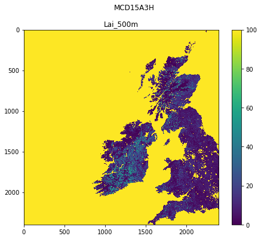
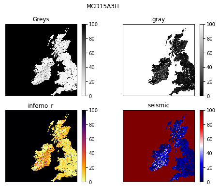
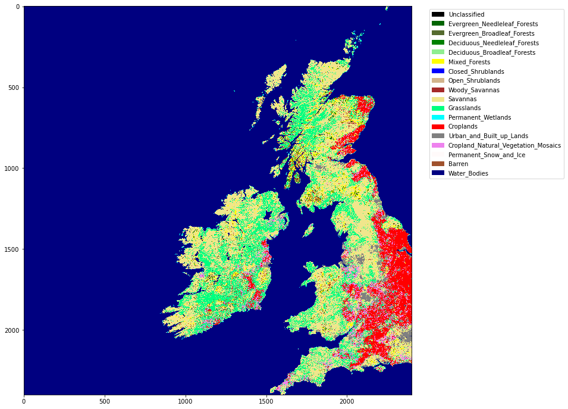

#  024 Image display


### Purpose

We have seen from [020_Python_files](020_Python_files.md) and [021_URLs](021_URLs.md)  how to access both text and binary datasets, either from the local file system or from a URL and in [023 Plotting](023_Plotting.md) how to use [`matplotlib`](https://matplotlib.org) for plotting graphs. 

In this section, we will learn how to view images using [`matplotlib`](https://matplotlib.org/3.3.1/tutorials/introductory/images.html).

You might follow these notes up by looking at the Python package [`folium`](https://python-visualization.github.io/folium/) for interactive displays.

### Prerequisites

You will need some understanding of the following:


* [001 Using Notebooks](001_Notebook_use.md)
* [002 Unix](002_Unix.md) with a good familiarity with the UNIX commands we have been through.
* [003 Getting help](003_Help.md)
* [010 Variables, comments and print()](010_Python_Introduction.md)
* [011 Data types](011_Python_data_types.md) 
* [012 String formatting](012_Python_strings.md)
* [013_Python_string_methods](013_Python_string_methods.md)
* [020_Python_files](020_Python_files.md)
* [021_URLs](021_URLs.md)
* [022_Pandas](022_Pandas.md)
* [023 Plotting](023_Plotting.md)

### Test

You should run a [NASA account test](004_Accounts.md) if you have not already done so.


## Read and plot a dataset

### MODIS

We have seen in [021_URLs](021_URLs.md) how we can access a MODIS dataset. In an [exercise](021_URLs.md#Exercise-4) we wrote a function `getModisTiledata` that returned a dictionary of spatial datasets, given a MODIS HDF filename. Here, we will use the similar function ` modis.get_data` that returns the same form of data dictionary, but driven by the year and day of year (`doy`). The product and other parameters are specified in the keyword arguments. We will look into MODIS products in more detail in a subsequent session. In this session, we will use `MCD15A3H` and 

For example, to get the LAI product `MCD15A3H` and the land cover product `MCD12Q1`, layer `LC_Type1` to visualise. Many of these datasets are pre-cached for you, so you should get a fast response. If the plotting seems to be taking too long, set `verbose=True` in the `kwargs` to get details of the underlying processing.

First then, we access the product `MCD15A3H`. This is produced every 4 days in a year, so in specifying `doy`, we use `doy=4*n + 1` for the `nth` dataset of the year.


```python
from  geog0111.modisUtils import getModisTiledata

kwargs = {
    'product'    : 'MCD15A3H',
    'tile'       : 'h17v03',
    'year'       : 2019,
    'doy'        : 41
}
data_MCD15A3H = getModisTiledata(verbose=False,timeout=300,**kwargs)
# specify day of year (DOY) and year
print(*data_MCD15A3H.keys())
```

    Fpar_500m Lai_500m FparLai_QC FparExtra_QC FparStdDev_500m LaiStdDev_500m


```python
# loop over dictionary items
for k,v in data_MCD15A3H.items():
    # do some neat formatting on k
    print(f'{k:<20s}: {v.shape}')
```

    Fpar_500m           : (2400, 2400)
    Lai_500m            : (2400, 2400)
    FparLai_QC          : (2400, 2400)
    FparExtra_QC        : (2400, 2400)
    FparStdDev_500m     : (2400, 2400)
    LaiStdDev_500m      : (2400, 2400)


So any of these datasets, `data[Fpar_500m]`, `data[Lai_500m]` are two dimensional datasets (`(2400, 2400)`) that we might display as images. For example `data[Lai_500m]`.

We follow much the same recipe as for [plotting line graphs](023_Plotting.md), but instead of using `axs.plot()` we use `axs.imshow()`. Further, we can set the subplot title with `axs.set_title(k)` as before. We can usefully include a colour wedge with the plot with `fig.colorbar(im, ax=axs)`.

When we plot with `axs.imshow()`, we can optionally use the keywords `vmin=` and `vmax=` to set upper and lower thresholds for the data plotted.

You should generally use `interpolation='nearest'` when plotting an image dataset as a measurement (e.g. a remote sensing dataset), otherwise it may be interpolated.


```python
import matplotlib.pyplot as plt

k = 'Lai_500m'
name = f'{kwargs["product"]}'

# plot size 
x_size,y_size = 8,6
shape = (1,1)

fig, axs = plt.subplots(shape[0],shape[1],figsize=(x_size,y_size))
# dont flatten if shape is (1,1)
if shape[0] == 1 and shape[1] == 1:  
    axs = [axs]
else:
    axs = axs.flatten()
# set the figure title
fig.suptitle(name)

# plot image data: use vmin and vmax to set limits
im = axs[0].imshow(data_MCD15A3H[k],\
                   vmin=0,vmax=100,\
                   interpolation='nearest')
axs[0].set_title(k)
fig.colorbar(im, ax=axs[0])
```


    <matplotlib.colorbar.Colorbar at 0x7fc61f3f9bd0>


    

    


#### Exercise 1

* Plot the first datasets in `data_MCD15A3H` as subplots in a 2 x 2 shape.

Hint: Use a loop for the keys of `data_MCD15A3H`. Set up the 2 x 2 subplots with:

    fig, axs = plt.subplots(2,2,figsize=(x_size,y_size))
    axs = axs.flatten()
    
then you can refer to the subplot axes as `ax[0]`, `ax[1]`, `ax[2]` and `ax[3]` when you loop over the keys. Don't forget to increase `x_size,y_size` appropriately.

## Colourmaps

As you would expect, you can customise your plots. We illustrate this by changing the colourmap used here in a pseudocolour display of the data. For some others, [please see the matplotlib tutorial](https://matplotlib.org/tutorials/introductory/images.html).

There are various ways to set the colour map, but when working with sub-images, trhe easiest is of the form:

    im = ax.imshow(data)
    im.set_cmap(c)

where `c` here is some colourmap.

For further discussions on colourmaps and options see the [relevant tutorial]( 
https://matplotlib.org/3.1.1/tutorials/colors/colormaps.html) and the [colour map reference](
https://matplotlib.org/3.1.1/gallery/color/colormap_reference.html).

In this set of sub-plots, we switch off the image ticks for a clearer plot.


```python
import matplotlib.pyplot as plt

k = 'Lai_500m'
name = f'{kwargs["product"]}'

# plot size 
x_size,y_size = 8,6
shape = (2,2)

fig, axs = plt.subplots(*shape,figsize=(x_size,y_size))
# dont flatten if shape is (1,1)
if shape[0] == 1 and shape[1] == 1:  
    axs = [axs]
else:
    axs = axs.flatten()

# this new cmd switches off the tick
plt.setp(axs, xticks=[], yticks=[])

# set the figure title
fig.suptitle(name)

cmaps = ['Greys','gray','inferno_r','seismic']

for i,c in enumerate(cmaps):
    # plot image data
    im = axs[i].imshow(data_MCD15A3H[k],\
                   vmin=0,vmax=100,\
                   interpolation='nearest')
    im.set_cmap(c)
    axs[i].set_title(c)
    fig.colorbar(im, ax=axs[i])
```


    

    


#### Exercise 2

* write a function called `im_display` that takes as input:
    * a data dictionary
    * a list of keywords of datasets to plot
    * optionally:
        * a title
        * a colourmap name
        * lower and upper limits for plot data (vmin, vmax)
        * x_size,y_size
        * subplots shape : e.g. (2,2)

You should assume some default values for the optional items if not given. For the subplots shape, assume it is `(n,1)` where `n` is the length of the keyword list.

You should set the default values of `vmin` and `vmax` to `None`, as this just then takes the dataset default minimum and maximum.

Your code should be well-documented.

* test your code

Note that you will have to experiment a bit with the `x_size,y_size` values to get a good plot. It is not easy to automate that.

## Quantised data: Land Cover

Sometimes we want quantised colourmaps, for example for a land cover classification map. You can do these perfectly well in `matplotlib`, but the process is a little more involved.

We will take as an example the MODIS product `MCD12Q1` over the UK. The land cover layer we are interested in is called `LC_Type1`. The [land cover names](https://lpdaac.usgs.gov/documents/101/MCD12_User_Guide_V6.pdf) associated with this are given in the file [data/LC_Type1_colour.csv](data/LC_Type1_colour.csv), along with example colour mappings.


```python
import pandas as pd

lc_Type1 = pd.read_csv('data/LC_Type1_colour.csv')
lc_Type1
```


<div>
<style scoped>
    .dataframe tbody tr th:only-of-type {
        vertical-align: middle;
    }

    .dataframe tbody tr th {
        vertical-align: top;
    }

    .dataframe thead th {
        text-align: right;
    }
</style>
<table border="1" class="dataframe">
  <thead>
    <tr style="text-align: right;">
      <th></th>
      <th>code</th>
      <th>class</th>
      <th>colour</th>
    </tr>
  </thead>
  <tbody>
    <tr>
      <th>0</th>
      <td>-1</td>
      <td>Unclassified</td>
      <td>black</td>
    </tr>
    <tr>
      <th>1</th>
      <td>1</td>
      <td>Evergreen_Needleleaf_Forests</td>
      <td>darkgreen</td>
    </tr>
    <tr>
      <th>2</th>
      <td>2</td>
      <td>Evergreen_Broadleaf_Forests</td>
      <td>darkolivegreen</td>
    </tr>
    <tr>
      <th>3</th>
      <td>3</td>
      <td>Deciduous_Needleleaf_Forests</td>
      <td>green</td>
    </tr>
    <tr>
      <th>4</th>
      <td>4</td>
      <td>Deciduous_Broadleaf_Forests</td>
      <td>lightgreen</td>
    </tr>
    <tr>
      <th>5</th>
      <td>5</td>
      <td>Mixed_Forests</td>
      <td>yellow</td>
    </tr>
    <tr>
      <th>6</th>
      <td>6</td>
      <td>Closed_Shrublands</td>
      <td>blue</td>
    </tr>
    <tr>
      <th>7</th>
      <td>7</td>
      <td>Open_Shrublands</td>
      <td>tan</td>
    </tr>
    <tr>
      <th>8</th>
      <td>8</td>
      <td>Woody_Savannas</td>
      <td>brown</td>
    </tr>
    <tr>
      <th>9</th>
      <td>9</td>
      <td>Savannas</td>
      <td>khaki</td>
    </tr>
    <tr>
      <th>10</th>
      <td>10</td>
      <td>Grasslands</td>
      <td>springgreen</td>
    </tr>
    <tr>
      <th>11</th>
      <td>11</td>
      <td>Permanent_Wetlands</td>
      <td>cyan</td>
    </tr>
    <tr>
      <th>12</th>
      <td>12</td>
      <td>Croplands</td>
      <td>red</td>
    </tr>
    <tr>
      <th>13</th>
      <td>13</td>
      <td>Urban_and_Built_up_Lands</td>
      <td>grey</td>
    </tr>
    <tr>
      <th>14</th>
      <td>14</td>
      <td>Cropland_Natural_Vegetation_Mosaics</td>
      <td>violet</td>
    </tr>
    <tr>
      <th>15</th>
      <td>15</td>
      <td>Permanent_Snow_and_Ice</td>
      <td>snow</td>
    </tr>
    <tr>
      <th>16</th>
      <td>16</td>
      <td>Barren</td>
      <td>sienna</td>
    </tr>
    <tr>
      <th>17</th>
      <td>17</td>
      <td>Water_Bodies</td>
      <td>navy</td>
    </tr>
  </tbody>
</table>
</div>


The process of setting up a colourmap is explained in this [Earth Lab](https://www.earthdatascience.org/courses/scientists-guide-to-plotting-data-in-python/plot-spatial-data/customize-raster-plots/customize-matplotlib-raster-maps/) page.

The three steps are:

    * set up colour names associated with the class names
    * generate matplotlib cmap and norm objects from these
    * set up the legend
    
We can choose colour names from the [`matplotlib` gallery](https://matplotlib.org/3.1.0/gallery/color/named_colors.html) if we don't like the defaults set up.

It is an annual dataset, with only valid files for January 1st of the year.


```python
from  geog0111.modisUtils import getModisTiledata

kwargs = {
    'product'    : 'MCD12Q1',
    'tile'       : 'h17v03',
    'year'       : 2019,
    'doy'        : 1
}

data_MCD12Q1 = getModisTiledata(verbose=False,timeout=300,**kwargs)
```


```python
# generate matplotlib cmap and norm objects from these
import matplotlib

cmap = matplotlib.colors.\
        ListedColormap(list(lc_Type1['colour']))
norm = matplotlib.colors.\
        BoundaryNorm(list(lc_Type1['code']), len(lc_Type1['code']))
```


```python
import matplotlib.patches
# set up the legend
legend_labels = dict(zip(list(lc_Type1['colour']),list(lc_Type1['class'])))
patches = [matplotlib.patches.Patch(color=c, label=l)
           for c,l in legend_labels.items()]
```


```python
# plot
import matplotlib.pyplot as plt
x_size,y_size = 12,12
fig, axs = plt.subplots(1,figsize=(x_size,y_size))
im = axs.imshow(data_MCD12Q1['LC_Type1'],cmap=cmap,norm=norm,interpolation='nearest')
plt.legend(handles=patches,
          bbox_to_anchor=(1.4, 1),
          facecolor="white")
```


    <matplotlib.legend.Legend at 0x7fc60c2f0c90>


    

    


#### Exercise 3

* Write a function called `plot_lc` that takes as input modis land cover dataset and plots the associated land cover map
* You might use `x_size,y_size` as optional inputs to improve scaling
* Show the function operating

## Summary

In this section, we have learned how to plot images from datasets we have read in or downloaded from the web. We have concentrated on MODIS datasets, stored in a data dictionary. We used `modis.get_data` to load the MODIS datasets. We developed a function called `im_display` to provide a simple wrapper for plotting.

We have also looked into how to do categorised mapping, for example for land cover, and written a function called `plot_lc` to achieve this.

Remember:


            import matplotlib
            import matplotlib.pyplot as plt

            
|function|comment|  keywords|
|---|---|:--|
| `im = axs.imshow(data2D)` | Display image of 2D data array `data2D` on sub-plot axis `axs` and return display object `im` | `vmin=` : minimum threshold for image display |
| | | `vmax=` : maximum threshold for image display |
| | | `interpolation=` : interpolation style (e.g. `'nearest'` |
| `fig.colorbar(im)` | Set colour bar for image plot object `im` | `ax=axs` plot on sub-plot `axs` |
| `im.set_cmap(c)` | set colourmap `c` for image object `im` | 
| | Examples being `['Greys','gray','inferno_r','seismic']`|
| `cmap = matplotlib.colors.ListedColormap(list_of_colours)` | set `cmap` to `Colormap` object from list of colours `list_of_colours` |
|`norm = matplotlib.colors.BoundaryNorm(list, nbound)` | set `BoundaryNorm` object `norm` to boundaries of values from `list` with `nbound` values |
|`matplotlib.patches.Patch(color=c, label=l)`| Set patches for legend with colours from list `c` and labedl from list `l`|  
| `plt.legend(handles=patches)` | set figure legend using `patches` |`bbox_to_anchor=(1.4, 1)` : shift of legend|
| | | `facecolor="white"` : facecolourt of legend (white here) |
        
          
 We have also used `getModisTiledata` from [geog0111.modisUtils](geog0111/modisUtils.py):        


```python
help(getModisTiledata)
```

    Help on function getModisTiledata in module geog0111.modisUtils:
    
    getModisTiledata(doy=None, year=2020, month=1, day=1, tile='h08v06', product='MCD15A3H', timeout=None, sds='None', version='006', no_cache=False, cache=None, verbose=False, force=False, altcache='/shared/groups/jrole001/geog0111')
        return MODIS data dictionary of given SDS for given MODIS tile
        
        N.B. You need to have a username and password to access the data.
        These are available at https://urs.earthdata.nasa.gov
        
        Example of use:
        
          from geog0111.modisUtils import getModisdata
        
          modinfo = {
            'product'  : 'MCD15A3H',
            'year'     : 2020,
            'month'    : 1,
            'day'      : 5,
            'tile'     : 'h08v06'
          }
        
          data = getModisdata(**modinfo,verbose=False)
          print(f'-> {*data.keys()}')
        
          -> Fpar_500m Lai_500m FparLai_QC FparExtra_QC FparStdDev_500m LaiStdDev_500m
        
        
        Returns data read from MODIS data product file
                  e.g. what you would find on 
        
               https://e4ftl01.cr.usgs.gov/MOTA/MCD15A3H.006/2020.01.05/MCD15A3H.A2020005.h08v06.006.2020010210940.hdf
        
                  Downloaded to some cache location e.g.
        
                  /Users/plewis/.modis_cache/e4ftl01.cr.usgs.gov/MOTA/MCD15A3H.006/2020.01.05/MCD15A3H.A2020005.h08v06.006.2020010210940.hdf
        
        Control options:
          year : int of year (2000+ for Terra, 2002+ for Aqua products)
                 (year=2020)
                 
          doy  : day of year (doy=None)
          OR
          month: int of month (1-12) (month=1)
          day  : int of day (1-31, as appropriate) (day=1)
          
          tile    : string of tile (tile='h08v06')  
          product : string of MODIS product name (product='MCD15A3H')
          version : int or string of version (version='006')
          sds     : only load these SDS (string or list)
               
          timeout : timeout in seconds
          verbose : verbosity (verbose=False)
          
          
        Cache options:
          no_cache : Set True if you don't want to use the cache 
                     (no_cache=False)
        
                     This is common for most functions, but 
                     modisFile() will use a cache in any case, 
                     as it has to store the file somewhere. 
                     If you don;'t want to keep that, then 
                     you can delete after use.
          cache    : Use cache='/home/somewhere/else' to specify 
                     a personal cache location with write permission 
                     (ie somewhere in your filespace)
                     Specify personal cache root. By default, 
                     this will be ~, and the cache will go into 
                     ~/.modis_cache. You can change that to 
                     somewhere else
                     here. It will still use the sub-directory 
                     .modis_cache.
                     Use cache='/home/somewhere/else' to specify a 
                     personal cache location with write permission 
                     (ie somewhere in your filespace)
          altcache : Specify system cache root. 
                     Use altcache='/home/notme/somewhere' to specify a 
                     system cache location with read permission 
                     (ie somewhere not necessarily in your filespace)
          force    : Bool : Use force=True to override information in the cache
          
        Get the URL associated with a MODIS product
        for a certain date and version. Since this can
        involve  an expensive call to get the html to access the file URL
        The html data used can be cached unless no_cache = True
        (See modisHTML())
        
        This function returns the URL for the product/date page listing
        
        The caching is done to avoid repeated calls to expensive URL downloads.
        The idea is that there will be a system cache, where shared files will
        be set up (where you have read permission), and a personal cache
        where you can read and write your own files. Unless you
        use force=True or disble cache with no_cache=True, then the code
        will look in (i) personal; (ii) system cache before attempting
        to download any file from a URL. 
        
        The cached files are stored in the same structure as the URL, i.e
        
        https://e4ftl01.cr.usgs.gov/MOTA/MCD15A3H.006/2020.01.05/MCD15A3H.A2020005.h08v06.006.2020010210940.hdf
        
        will be stored (personal cache) as:
        
        ~/.modis_cache/e4ftl01.cr.usgs.gov/MOTA/MCD15A3H.006/2020.01.05/MCD15A3H.A2020005.h08v06.006.2020010210940.hdf
        
        The html cache is what is returned from e.g.
        
        https://e4ftl01.cr.usgs.gov/MOTA/MCD15A3H.006/2020.01.05
        
        and is stored as eg
        
        ~/.modis_cache/e4ftl01.cr.usgs.gov/MOTA/MCD15A3H.006/2020.01.05/index.html
    

