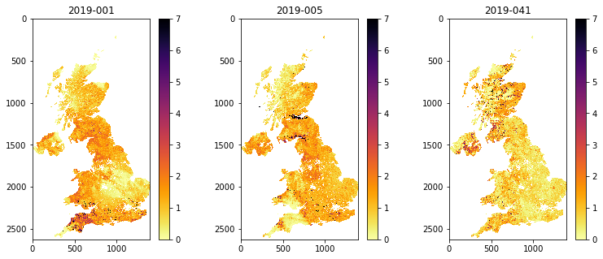
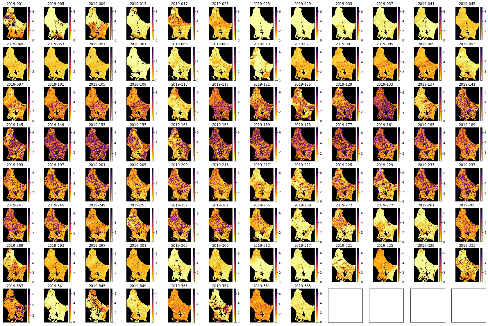

# 041 GDAL: time series

### Purpose

In this section, we'll continue to look at the MODIS LAI, with a view to forming a time series dataset. At the end of this session, you will be able to generate a 3D numpy array of some MODIS geophysical variable for a selcted area and time.

### Prerequisites

* [030_NASA_MODIS_Earthdata](030_NASA_MODIS_Earthdata.md)
* [031_Numpy](031_Numpy.md)
* [032_more_numpy](032_More_numpy.md)
* [040_GDAL_mosaicing_and_masking](040_GDAL_mosaicing_and_masking.md)

You must make sure you can recall the details of the work covered in [040_GDAL_mosaicing_and_masking](040_GDAL_mosaicing_and_masking.md). You will also need to know how to do [graph plotting](023_Plotting.md), including sub-figures and errorbars, and [image display](024_Image_display.md).

### Test

You should run a [NASA account test](004_Accounts.md) if you have not already done so.

## Introduction

Recall that we can use `getModis` from [`geog0111.modisUtils`](geog0111/modisUtils.py) as a simple interface to download and stitch MODIS data.

For example:


```python
from geog0111.modisUtils import getModis

warp_args = {
    'dstNodata'     : 255,
    'format'        : 'MEM',
    'cropToCutline' : True,
    'cutlineWhere'  : "FIPS='UK'",
    'cutlineDSName' : 'data/TM_WORLD_BORDERS-0.3.shp'
}

kwargs = {
    'tile'      :    ['h17v03','h18v03','h17v04','h18v04'],
    'product'   :    'MCD15A3H',
    'sds'       :    'Lai_500m',
    'doys'       : [1,5,41],
    'year'      : 2019,
    'warp_args' : warp_args
}

datafiles,bnames = getModis(verbose=False,timeout=10000,**kwargs)

print(datafiles)
print(bnames)
```

    ['work/stitch_Lai_500m_2019_001_Tiles_h17v03_h18v03_h17v04_h18v04_Selektor_FIPS_UK_warp.vrt', 'work/stitch_Lai_500m_2019_005_Tiles_h17v03_h18v03_h17v04_h18v04_Selektor_FIPS_UK_warp.vrt', 'work/stitch_Lai_500m_2019_041_Tiles_h17v03_h18v03_h17v04_h18v04_Selektor_FIPS_UK_warp.vrt']
    ['2019-001', '2019-005', '2019-041']


## Timeseries

We can conveniently generate a timeseries dataset using the `gdal` VRT file approach we used in [040_GDAL_mosaicing_and_masking](040_GDAL_mosaicing_and_masking.md). 

We can directly use the output from `getModis` for this.


We use `gdal.BuildVRT()` as we have previously, specifying the output name `work/stitch_set.vrt` here, and the list of SDS that goes in to the time series,`datafiles` here. The one difference is that we set `separate=True` for a time series (or for multiple bands) so the data aren't merged spatially.


```python
from osgeo import gdal
import numpy as np

# build a VRT "work/stitch_set.vrt"
stitch_vrt = gdal.BuildVRT("work/stitch_set.vrt", datafiles,separate=True)
del stitch_vrt
# test it by reading and plotting
g = gdal.Open("work/stitch_set.vrt")

# apply scaling and read
data = g.ReadAsArray() * 0.1
print(data.shape,data.dtype)
```

    (3, 2623, 1394) float64


The dataset is now 3D. The first dimensions represent the time samples, so:

    data[0] -> bnames[0]
    
etc.


```python
import numpy as np
for i in range(data.shape[0]):
    print(f'band {bnames[i]} -> mean {np.mean(data[i])}')
```

    band 2019-001 -> mean 18.3917659748686
    band 2019-005 -> mean 18.39242177274097
    band 2019-041 -> mean 18.313179488806387


These are strange average LAI numbers. Why would that be?

#### Exercise 1

We have seen in [040_GDAL_mosaicing_and_masking](040_GDAL_mosaicing_and_masking.md) that you can use `gdal` to creat a GeoTiff format image, for example with:

    g = gdal.Warp(output_name, input_name ,format='GTiff',options=['COMPRESS=LZW'])
    g.FlushCache()

* Convert the `gdal` file `work/stitch_set.vrt` to a more portable GeoTiff file called `work/stitch_set.tif`
* Confirm that this has worked by reading and displaying data from the file

The reason for the 'funny' averages above was because the data is not masked: it includes invalid numbers (e.g. 255) where there are no data.

Now let's mask out invalid data points (`> 10.0` when scaled by 0.1), and display the results:


```python
# valid mask
data[data>10.0] = np.nan
print(data.shape)
```

    (3, 2623, 1394)


```python
from osgeo import gdal
import matplotlib.pyplot as plt

fig, axs = plt.subplots(1,3,figsize=(13,5))
axs = axs.flatten()

for i in range(data.shape[0]):
    im = axs[i].imshow(data[i],vmax=7,\
                cmap=plt.cm.inferno_r,interpolation='nearest')
    fig.colorbar(im, ax=axs[i])
    axs[i].set_title(bnames[i])
```


    

    


## A year of data

To get a year of LAI data for Luxembourg, we can specify `doys = [i for i in range(1,366,4)]`. Note that we could have chosen any location, but we select a small country to make the running more feasible in a practical session.

If the data are already downloaded into the local cache, it should not take too long to form the time series. It will need to generate the VRT files for how every many files and tile you have requested, so that may take some tens of minutes, even if the HDF files are already generated.

If you are attempting to get data not already in the cache, it will take some considerable time to download these datasets for whole years, for multiple tiles. 

If you want to download a dataset that is not covered in these notebooks, you are of course welcome to do so, but plan your work ahead of time, and try to pre-download the data before attempting any processing. In such a case, you should take some code such as that below and paste it into a Python file and run that as a Python script from a command line. You might make sure you set:

    'verbose' : True
    
in the `kwargs` dictionary if you want some feedback about any long-running processes. 


```python
from geog0111.modisUtils import getModis

warp_args = {
    'dstNodata'     : 255,
    'format'        : 'MEM',
    'cropToCutline' : True,
    'cutlineWhere'  : "FIPS='LU'",
    'cutlineDSName' : 'data/TM_WORLD_BORDERS-0.3.shp'
}

kwargs = {
    'tile'      :    ['h18v03','h18v04'],
    'product'   :    'MCD15A3H',
    'sds'       :    'Lai_500m',
    'doys'      : np.arange(1,366,4),
    'year'      : 2019,
    'warp_args' : warp_args
}

datafiles,bnames = getModis(verbose=False,timeout=10000,**kwargs)
```


```python
# check the files
print(f'filenames of the form: {datafiles[0]}\n')
print(bnames)
```

    filenames of the form: work/stitch_Lai_500m_2019_001_Tiles_h18v03_h18v04_Selektor_FIPS_LU_warp.vrt
    
    ['2019-001', '2019-005', '2019-009', '2019-013', '2019-017', '2019-021', '2019-025', '2019-029', '2019-033', '2019-037', '2019-041', '2019-045', '2019-049', '2019-053', '2019-057', '2019-061', '2019-065', '2019-069', '2019-073', '2019-077', '2019-081', '2019-085', '2019-089', '2019-093', '2019-097', '2019-101', '2019-105', '2019-109', '2019-113', '2019-117', '2019-121', '2019-125', '2019-129', '2019-133', '2019-137', '2019-141', '2019-145', '2019-149', '2019-153', '2019-157', '2019-161', '2019-165', '2019-169', '2019-173', '2019-177', '2019-181', '2019-185', '2019-189', '2019-193', '2019-197', '2019-201', '2019-205', '2019-209', '2019-213', '2019-217', '2019-221', '2019-225', '2019-229', '2019-233', '2019-237', '2019-241', '2019-245', '2019-249', '2019-253', '2019-257', '2019-261', '2019-265', '2019-269', '2019-273', '2019-277', '2019-281', '2019-285', '2019-289', '2019-293', '2019-297', '2019-301', '2019-305', '2019-309', '2019-313', '2019-317', '2019-321', '2019-325', '2019-329', '2019-333', '2019-337', '2019-341', '2019-345', '2019-349', '2019-353', '2019-357', '2019-361', '2019-365']


We can build a VRT dataset as before:


```python
stitch_vrt = gdal.BuildVRT("work/stitch_time.vrt", datafiles,separate=True)
del stitch_vrt
```

And read the data into a numpy array:


```python
from osgeo import gdal

g = gdal.Open("work/stitch_time.vrt")
data = g.ReadAsArray() * 0.1
```

We can now plot the data on sub-plots:


```python
import matplotlib.pyplot as plt

shape=(8,12)
x_size,y_size=(30,20)

fig, axs = plt.subplots(*shape,figsize=(x_size,y_size))
axs = axs.flatten()
plt.setp(axs, xticks=[], yticks=[])

for i in range(data.shape[0]):
    im = axs[i].imshow(data[i],vmax=7,cmap=plt.cm.inferno_r,\
                       interpolation='nearest')
    axs[i].set_title(bnames[i])
    fig.colorbar(im, ax=axs[i])
```


    

    


### Plotting time series

We might now want to plot some time series. We will need to know the day of year associated with each spatial dataset in the time series. We could just attempt to specify `doys = [i for i in range(1,366,4)]` as above. But that might not be robust (e.g. if no data were available for some particular day).

It is *better* to try to develop an internally consistent dataset. The `doy` information associated with each spatial dataset in the time series is encoded in the band name strings we examined above, such as `2019-001`.

First, extract the `doy` from `bnames`:


```python
print(bnames)
```

    ['2019-001', '2019-005', '2019-009', '2019-013', '2019-017', '2019-021', '2019-025', '2019-029', '2019-033', '2019-037', '2019-041', '2019-045', '2019-049', '2019-053', '2019-057', '2019-061', '2019-065', '2019-069', '2019-073', '2019-077', '2019-081', '2019-085', '2019-089', '2019-093', '2019-097', '2019-101', '2019-105', '2019-109', '2019-113', '2019-117', '2019-121', '2019-125', '2019-129', '2019-133', '2019-137', '2019-141', '2019-145', '2019-149', '2019-153', '2019-157', '2019-161', '2019-165', '2019-169', '2019-173', '2019-177', '2019-181', '2019-185', '2019-189', '2019-193', '2019-197', '2019-201', '2019-205', '2019-209', '2019-213', '2019-217', '2019-221', '2019-225', '2019-229', '2019-233', '2019-237', '2019-241', '2019-245', '2019-249', '2019-253', '2019-257', '2019-261', '2019-265', '2019-269', '2019-273', '2019-277', '2019-281', '2019-285', '2019-289', '2019-293', '2019-297', '2019-301', '2019-305', '2019-309', '2019-313', '2019-317', '2019-321', '2019-325', '2019-329', '2019-333', '2019-337', '2019-341', '2019-345', '2019-349', '2019-353', '2019-357', '2019-361', '2019-365']


we can try to extract the information from these strings then. Let's build up to that, by considering a single example string, and work out how to deal with that. Once we know that, we can build a loop around it (e.g. in a list comprehension like we had for `[i for i in range(1,366,4)]`.


```python
# convert to 1 by splitting the string
test = '2019-001'
int(test.split('-')[1])
```


    1


```python
doy = [int(i.split('-')[1]) for i in bnames]
print(doy)
```

    [1, 5, 9, 13, 17, 21, 25, 29, 33, 37, 41, 45, 49, 53, 57, 61, 65, 69, 73, 77, 81, 85, 89, 93, 97, 101, 105, 109, 113, 117, 121, 125, 129, 133, 137, 141, 145, 149, 153, 157, 161, 165, 169, 173, 177, 181, 185, 189, 193, 197, 201, 205, 209, 213, 217, 221, 225, 229, 233, 237, 241, 245, 249, 253, 257, 261, 265, 269, 273, 277, 281, 285, 289, 293, 297, 301, 305, 309, 313, 317, 321, 325, 329, 333, 337, 341, 345, 349, 353, 357, 361, 365]


It is interesting to see a set of sub-plots for a range of pixel locations. We can follow tghe approach we have taken to sub-plots previously, but now we want to make use of the 2D nature of the sub-plot `axs` variable (recall that previously we have flattened this to a 1D representation).

We will define a sub-plot shape: `shape=(10,10)` and a starting pixel `pixel = (100,70)`. We will then loop in row and column to produce the sub-plots:


```python
import matplotlib.pyplot as plt

x_size,y_size=(20,20)

shape=(10,10)
fig, axs = plt.subplots(*shape,figsize=(x_size,y_size))
plt.setp(axs, xticks=[], yticks=[])

pixel = (100,70)
x = doy

for i in range(shape[0]):
    p0 = pixel[0] + i
    for j in range(shape[1]):
        p1 = pixel[1] + j
        im = axs[i,j].plot(x,data[:,p0,p1])
        axs[i,j].set_title(f'{p0} {p1}')
        # ensure the same scale for all
        axs[i,j].set_ylim(0,7)
```


    

    


#### Exercise 2

* Produce a set of spatial plots of the quantity `Fpar_500m` over Luxembourg for 2019

#### Exercise 3

Write a function called `modisAnnual(**kwargs)` with arguments based on:

    warp_args = {
        'dstNodata'     : 255,
        'format'        : 'MEM',
        'cropToCutline' : True,
        'cutlineWhere'  : "FIPS='LU'",
        'cutlineDSName' : 'data/TM_WORLD_BORDERS-0.3.shp'
    }

    kwargs = {
        'tile'      :    ['h18v03','h18v04'],
        'product'   :    'MCD15A3H',
        'sds'       :    ['Lai_500m', 'Fpar_500m'],
        'doys'      : np.arange(1,366,4),
        'year'      : 2019,
        'warp_args' : warp_args
        'ofile_root': 'work/output_filename_ex3'
    }

 
where `sds` is a list of SDS

That returns:

    bnames  : names for the items in first (time) dimension
    odict   : a dictionary with items in sds for keys and the names of associated VRT files as values
    

## Uncertainty and weighting

The full set of SDS available is 

    ['Fpar_500m',
     'Lai_500m',
     'FparLai_QC',
     'FparExtra_QC',
     'FparStdDev_500m',
     'LaiStdDev_500m']
     
We should always examine any uncertainty information available when trying to interpret a dataset. In this exercise, we will take the uncertainty, defined as a standard deviation, and generate a weight from this in the form:

    W  = 1/(std * std)
    
where std is the uncertainty. Where this weighting is high, we can put more emphasis on the reliability of the data than when it is low.

We make `modisAnnual()` available from `geog0111.modisUtils` so we can load multiple SDS datasets into a data dictionary:


```python
from geog0111.modisUtils import modisAnnual

warp_args = {
    'dstNodata'     : 255,
    'format'        : 'MEM',
    'cropToCutline' : True,
    'cutlineWhere'  : "FIPS='LU'",
    'cutlineDSName' : 'data/TM_WORLD_BORDERS-0.3.shp'
}

kwargs = {
    'tile'      :    ['h18v03','h18v04'],
    'product'   :    'MCD15A3H',
    'sds'       :    ['Fpar_500m','Lai_500m','FparLai_QC','FparExtra_QC','FparStdDev_500m','LaiStdDev_500m']
,
    'doys'      : np.arange(1,366,4),
    'year'      : 2019,
    'warp_args' : warp_args
}

# run
odict,bnames = modisAnnual(**kwargs)

# outputs
print(odict,bnames) 
```

    {'Fpar_500m': 'work/output_filename_Selektor_FIPS_LU_YEAR_2019_DOYS_1_365_SDS_Fpar_500m.vrt', 'Lai_500m': 'work/output_filename_Selektor_FIPS_LU_YEAR_2019_DOYS_1_365_SDS_Lai_500m.vrt', 'FparLai_QC': 'work/output_filename_Selektor_FIPS_LU_YEAR_2019_DOYS_1_365_SDS_FparLai_QC.vrt', 'FparExtra_QC': 'work/output_filename_Selektor_FIPS_LU_YEAR_2019_DOYS_1_365_SDS_FparExtra_QC.vrt', 'FparStdDev_500m': 'work/output_filename_Selektor_FIPS_LU_YEAR_2019_DOYS_1_365_SDS_FparStdDev_500m.vrt', 'LaiStdDev_500m': 'work/output_filename_Selektor_FIPS_LU_YEAR_2019_DOYS_1_365_SDS_LaiStdDev_500m.vrt'} ['2019-001', '2019-005', '2019-009', '2019-013', '2019-017', '2019-021', '2019-025', '2019-029', '2019-033', '2019-037', '2019-041', '2019-045', '2019-049', '2019-053', '2019-057', '2019-061', '2019-065', '2019-069', '2019-073', '2019-077', '2019-081', '2019-085', '2019-089', '2019-093', '2019-097', '2019-101', '2019-105', '2019-109', '2019-113', '2019-117', '2019-121', '2019-125', '2019-129', '2019-133', '2019-137', '2019-141', '2019-145', '2019-149', '2019-153', '2019-157', '2019-161', '2019-165', '2019-169', '2019-173', '2019-177', '2019-181', '2019-185', '2019-189', '2019-193', '2019-197', '2019-201', '2019-205', '2019-209', '2019-213', '2019-217', '2019-221', '2019-225', '2019-229', '2019-233', '2019-237', '2019-241', '2019-245', '2019-249', '2019-253', '2019-257', '2019-261', '2019-265', '2019-269', '2019-273', '2019-277', '2019-281', '2019-285', '2019-289', '2019-293', '2019-297', '2019-301', '2019-305', '2019-309', '2019-313', '2019-317', '2019-321', '2019-325', '2019-329', '2019-333', '2019-337', '2019-341', '2019-345', '2019-349', '2019-353', '2019-357', '2019-361', '2019-365']


We can read some of these data in now:


```python
from osgeo import gdal

g = gdal.Open(odict['Lai_500m'])
if g:
    Lai_500m = g.ReadAsArray() * 0.1
    print(Lai_500m.shape)

g = gdal.Open(odict['LaiStdDev_500m'])
if g:
    LaiStdDev_500m = g.ReadAsArray() * 0.1
    print(LaiStdDev_500m.shape)
```

    (92, 175, 122)
    (92, 175, 122)


There is a feature in the `LaiStdDev_500m` dataset where some pixels have apparently zero uncertainty. Indeed, all LAI values with an uncertainty under 1.0 seem suspect as individual values. So we treat them hear, to set all values less than 1 to 1.

We know that LAI values over 10 (100 * 0.1) are invalid, so we should make sure these are also weighted zero:


```python
import numpy as np

weight = np.zeros_like(LaiStdDev_500m)
std = LaiStdDev_500m

# fix low values
std[std<1.0] = 1.0

mask = (std > 0)
weight[mask] = 1./(std[mask]**2)

weight[Lai_500m > 10] = 0.
weight[LaiStdDev_500m==0] = 0.
# look at some stats
print(weight.min(),weight.max())
```

    0.0 1.0


We can now go ahead and plot the dataset and the weights. We switch to a greyscale colourmap to make the interpretation of numbers easier.


```python
# produce image plots of the both quantities
import matplotlib.pyplot as plt

shape=(8,12)
x_size,y_size=(30,20)

fig, axs = plt.subplots(*shape,figsize=(x_size,y_size))
axs = axs.flatten()
plt.setp(axs, xticks=[], yticks=[])
fig.suptitle("LAI Luxembourg 2019")
for i in range(Lai_500m.shape[0]):
    im = axs[i].imshow(Lai_500m[i],vmax=7,cmap=plt.cm.gray,\
                       interpolation='nearest')
    axs[i].set_title(bnames[i])
    fig.colorbar(im, ax=axs[i])
```


    

    


```python
# Plot the weight
import matplotlib.pyplot as plt

shape=(8,12)
x_size,y_size=(30,20)

fig, axs = plt.subplots(*shape,figsize=(x_size,y_size))
axs = axs.flatten()
plt.setp(axs, xticks=[], yticks=[])
fig.suptitle("LAI weight Luxembourg 2019")

for i in range(Lai_500m.shape[0]):
    im = axs[i].imshow(weight[i],vmax=1,cmap=plt.cm.gray,\
                       interpolation='nearest')
    axs[i].set_title(bnames[i])
    fig.colorbar(im, ax=axs[i])
```


    

    


```python
# LAI time series
import matplotlib.pyplot as plt

doy = [int(i.split('-')[1]) for i in bnames]

x_size,y_size=(20,20)

shape=(10,10)
fig, axs = plt.subplots(*shape,figsize=(x_size,y_size))
plt.setp(axs, xticks=[], yticks=[])

pixel = (100,70)
x = doy

for i in range(shape[0]):
    p0 = pixel[0] + i
    for j in range(shape[1]):
        p1 = pixel[1] + j
        im = axs[i,j].plot(x,Lai_500m[:,p0,p1])
        axs[i,j].set_title(f'{p0} {p1}')
        # ensure the same scale for all
        axs[i,j].set_ylim(0,7)
```


    

    


```python
# weight time series plots 
import matplotlib.pyplot as plt
doy = [int(i.split('-')[1]) for i in bnames]

x_size,y_size=(20,20)

shape=(10,10)
fig, axs = plt.subplots(*shape,figsize=(x_size,y_size))
plt.setp(axs, xticks=[], yticks=[])

pixel = (100,70)
x = doy

for i in range(shape[0]):
    p0 = pixel[0] + i
    for j in range(shape[1]):
        p1 = pixel[1] + j
        im = axs[i,j].plot(x,weight[:,p0,p1])
        axs[i,j].set_title(f'{p0} {p1}')
        # ensure the same scale for all
        axs[i,j].set_ylim(0,1)
```


    

    


We can look at an individual plot now, and use the weights for error bars.

In this case, we want to convert the array `weight` to an array `error`, applying the opposite of what we did above to get standard deviation, and multiplying by [1.96](https://en.wikipedia.org/wiki/1.96).

We want to avoid the division `1/0`, so we first build an array the same as weight, but fiulled with zero values:

    error = np.zeros_like(weight)
    
and then only do the division for the mask `weight>0`:

    error[weight>0] = np.sqrt(1./(weight[weight>0] )) * 1.96


```python
import matplotlib.pyplot as plt

error = np.zeros_like(weight)
error[weight>0] = np.sqrt(1./(weight[weight>0] )) * 1.96

doy = [int(i.split('-')[1]) for i in bnames]
p0,p1 = (107,72)
x_size,y_size=(10,5)

shape=(10,10)
fig, axs = plt.subplots(1,1,figsize=(x_size,y_size))

pixel = (100,70)
x = doy

axs.errorbar(x,Lai_500m[:,p0,p1],yerr=error[:,p0,p1])
axs.set_title(f'{p0} {p1}')
# ensure the same scale for all
axs.set_ylim(0,7)
axs.set_xlabel('DOY 2019')
axs.set_ylabel('LAI')
```


    Text(0, 0.5, 'LAI')


    

    


We might question the validity of some of the LAI uncertainty here: we expect LAI to have a smnooth trajectory in time, but that is clearly not always the case here. However, they provide a traceable estimate of the reliability of each individual measurement and are useful in that respect.

#### Exercise 3

* Write a function `getLai` that takes as argument:
    
        year : integer year
        tile : list of tiles to process
        fips : country fips code (e.g. BE for Belgium)
        
  and returns the annual LAI, standard deviation and day of year

* test your code for Belgium for 2018 for tiles `['h17v03','h18v03','h17v04','h18v04']`
* show the shape of the arrays returned

Hint: You may find it useful to use `modisAnnual`


## Summary

We now know how to combine geospatial data in both space and time VRT files using `gdal`. Remember that we can also do such things using `numpy`, but if we are able to keep the geospatial information and other metadata in a `gdal` file, so much the better. We have seen how to write the dataset to a portable file format such as GeoTiff.

We have seen that some datasets such as the MODIS LAI product come with a per-pixel estimate of uncertainty. We have investigated this data field and used it to provide a weighting to associate with the reliability of each pixel. We have seen how to generate, filter, and process 3D spatio-temporal datasets. The examples here 

Remember:


```python
from geog0111.modisUtils import modisAnnual
help(modisAnnual)
```

We have also seen how we can incrementally develop codes to do more complex tasks and wrap up a utility such as `getLai` in the exercise above to retrieve a ready-to-use dataset.
