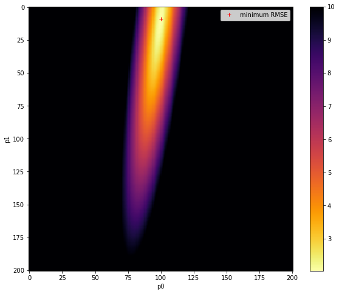
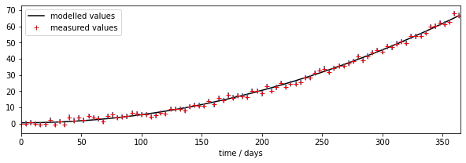

# 050 Models : Answers to exercises

#### Exercise 1

In a file `lut_RMSE.py` do the following:

        import numpy as np
        # define the min and max and step for the grid we want
        p0min,p0max,p0step = 0.0,10.0,0.05
        p1min,p1max,p1step = 0.0,0.001,0.000005

        gridp0,gridp1 = np.mgrid[p0min:p0max+p0step:p0step,\
                                 p1min:p1max+p1step:p1step]


* Write a function `gen_lut` to return a 2D parameter (Look up table -- LUT) grid using `np.mgrid` as above as `param = [gridp0,gridp1]`

        # simple model 
        def model(driver,param):
            '''2-parameter quadratic model with noise'''
            return param[0] + param[1] * driver * driver
          
* Write a function `model` to describe the model we will be using from the code above
            
        # code to use
        # time driver every 4 days for measurement    
        tmdriver = np.arange(0,365,4,dtype=np.int)
        # generate a pseudo-measurement
        p0 = np.array([5.0,0.0005])
        measure = model(tmdriver,p0) + 5*(np.random.random(tmdriver.shape)-0.5)
        # just make up some weights for this exercise
        measure_weight = (2 + np.random.random(tmdriver.shape))/4
        
* Write a function `gen_meas` to generate a pseudo-measurement based on the model and some noise. It should print the value of the parameters used in the model, and return `tmdriver, measure, measure_weight` corresponding to:

        * tmdriver:       array of (Nm,) floats of the day of year on which to do modelling
        * measure:        array of (Nm,) floats of measurements over sampled days of the year
        * measure_weight: array of (Nm,) floats of the weights associated with the measurements

* Write a function `lut_RMSE` that takes as inputs:

        * `param`:          list of `[p0,p1]` with `p0` and `p1` being arrays of shape `(Np0,Np1)` representing a the LUT grid over parameter space
        * `tmdriver`:       array of (Nm,) integers: the days on which the measurements occur 
        * `measure:`        array of (Nm,) floats of measurements over sampled days of the year
        * `measure_weight`: array of (Nm,) floats of the weights associated with the measurements
    
 That runs the model `model(tmdriver,param)`, calculates the weighted RMSE between the measurements and the modelled values for each parameter pair, and returns a grid of shape `(Np0,Np1)` values of RMSE associated with each parameter pair.
 
 * Write a function `runner()` that 
    * generates tmdriver, the array of (92,) floats for every 4 day of year on which to do modelling
    * gets a LUT `param` from `gen_lut`
    * gets a pseudo-measurement from `gen_meas`
    * gets a 2-D array of RMSE corresponding to the parameter grid
    * calculated and prints the value of the parameters corresponding to the minimum RMSE,
    * returns the RMSE array, the LUT, and the measurements
 
* Run `runner()` in a notebook
* Plot the RMSE values returned from this as an image
* Verify that you have identified the minimum RMSE
* Set different parameters in `gen_meas` to generate a different pseudo-measurement and repeat the process.
* Comment on the results


```python
# ANSWER
# run your own script 
!geog0111/lut_RMSE.py
```

    original parameters: [0.4, 0.0002]
    min rmse
    2.372352991393801
    index: 2452: 0.6000000000000001,0.0002
    parameters: 0.6000000000000001 0.0002


```python
# ANSWER
import numpy as np
# Run runner() in a notebook
from geog0111.lut_RMSE import runner, model, gen_lut
RMSE,param,(measure,measure_weight,tmdriver) = runner()
```

    original parameters: [0.4, 0.0002]
    min rmse
    2.446801263996164
    index: 41: 0.0,0.00020500000000000002
    parameters: 0.0 0.00020500000000000002


```python
# confirm: same as in runner?
# use argmin to find min, but need to flatten/reshape arrays first
p0,p1 = param
p0_ = np.ravel(p0)
p1_ = np.ravel(p1)
# min over time axis
imin = np.argmin(RMSE,axis=0)

print(f'index: {imin}: {p0_[imin]},{p1_[imin]}')
# back to 2D
ip0min,ip1min = np.unravel_index(imin,p0.shape)
p0min = p0[ip0min,ip1min]
p1min = p1[ip0min,ip1min]

p = np.array([p0min,p1min])
print(f'parameters: {p[0]} {p[1]}')
```

    index: 41: 0.0,0.00020500000000000002
    parameters: 0.0 0.00020500000000000002


```python
import matplotlib.pyplot as plt
# Plot the reshaped RMSE values returned from this as an image

# plot it
fig, axs = plt.subplots(1,1,figsize=(10,8))
im = axs.imshow(RMSE.reshape(p0.shape),interpolation="nearest",\
                vmax=10,cmap=plt.cm.inferno_r)
fig.colorbar(im, ax=axs)
axs.set_xlabel('p0')
axs.set_ylabel('p1')
plt.plot([ip1min],[ip0min],'r+',label="minimum RMSE")
axs.legend(loc='best')
```


    <matplotlib.legend.Legend at 0x7fbaf040d4d0>


    

    


```python
import numpy as np
from geog0111.lut_RMSE import gen_meas,model,lut_RMSE

# change the original parameters 
tdriver = np.arange(0,365,1,dtype=np.int)
# gets a LUT `param` from `gen_lut`
param = gen_lut()
# gets a pseudo-measurement from `gen_meas`
tmdriver,measure,measure_weight = gen_meas(p0=[0.7,0.0005])
# gets a 2-D array of RMSE corresponding to the parameter grid
RMSE = lut_RMSE(param,tmdriver,measure,measure_weight)
# calculated and prints the value of the parameters corresponding to the minimum RMSE,
min_rmse = RMSE.min()
print(f'min rmse\n{min_rmse}')

# use argmin to find min, but need to flatten/reshape arrays first
p0,p1 = param
p0_ = np.ravel(p0)
p1_ = np.ravel(p1)
# min over time axis
imin = np.argmin(RMSE,axis=0)

print(f'index: {imin}: {p0_[imin]},{p1_[imin]}')
# back to 2D
ip0min,ip1min = np.unravel_index(imin,p0.shape)
p0min = p0[ip0min,ip1min]
p1min = p1[ip0min,ip1min]

p = np.array([p0min,p1min])
print(f'parameters: {p[0]} {p[1]}')


min_rmse = RMSE.min()

fig, axs = plt.subplots(1,1,figsize=(10,8))
im = axs.imshow(RMSE.reshape(p0.shape),interpolation="nearest",\
                vmax=10,cmap=plt.cm.inferno_r)
fig.colorbar(im, ax=axs)
axs.set_xlabel('p0')
axs.set_ylabel('p1')
plt.plot([ip1min],[ip0min],'r+',label="minimum RMSE")
axs.legend(loc='best')
```

    original parameters: [0.7, 0.0005]
    min rmse
    2.034386901987606
    index: 1909: 0.45,0.0005
    parameters: 0.45 0.0005


    <matplotlib.legend.Legend at 0x7fbaf8941750>


    

    


```python
import matplotlib.pyplot as plt

# error bars
std = 1./np.sqrt(measure_weight) * 1.96

# time driver every day
tdriver = np.arange(0,365,1,dtype=np.int)
# get the parameters we siolved for
p = np.array([p0min,p1min])
print(p)
output  = model(tdriver,p)

# plot
fig, axs = plt.subplots(1,1,figsize=(10,3))
axs.set_xlim(0,365)
axs.plot(tdriver,output,'k',label='modelled values')
axs.errorbar(tmdriver,measure,yerr=std,ls='none')
axs.plot(tmdriver,measure,'r+',label='measured values')
# set legend now
axs.legend(loc='best')
axs.set_xlabel(f'time / days')

print(f'measurements: tmdriver shape {tmdriver.shape}')
print(f'model output: tdriver shape  {tdriver.shape}')
```

    [0.45   0.0005]
    measurements: tmdriver shape (92,)
    model output: tdriver shape  (365,)


    

    


```python
# Comment on the results

msg = '''
We confirm the findings above, but are now able to see the form of the error surface in much greater detail. 
'''
print(msg)
```

    
    We confirm the findings above, but are now able to see the form of the error surface in much greater detail. 
    

