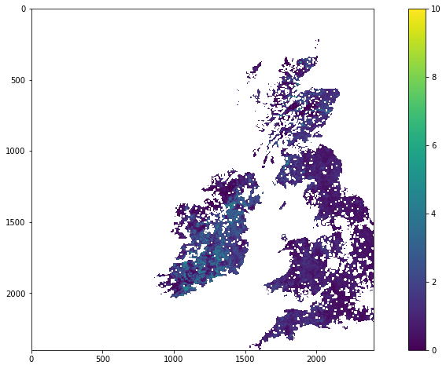

# Formative Assessment: `numpy` : Answers to exercises

#### Exercise 1

Recall from [previous sections](030_NASA_MODIS_Earthdata.md#MOTA) how to retrieve a MODIS LAI dataset for a particular date. Recall also values of greater than 100 are invalid, and that a scaling of 0.1 should be applied to the LAI.

* Load a MODIS LAI dataset SDS `Lai_500m` for tile `h17v03` day of year 41, 2019. 
* Call the 2D array `data` and confirm that it has a shape (2400, 2400)
* build a mask called `mask` of invalid pixels 
* print the percentage of invalid pixels to 2 decimal places (hint: sum with `sum`)
* scale the data array as appropriate to obtain LAI
* set invalid data values to 'not a number' `np.nan`
* display the resulting image


```python
# ANSWER
import numpy as np
import matplotlib.pyplot as plt
from geog0111.modisUtils import modisAnnual
from osgeo import gdal

kwargs = {
    'tile'      :    ['h17v03'],
    'product'   :    'MCD15A3H',
    'sds'       :    ['Lai_500m'],
    'doys'       : [41],
    'year'      : 2019,
}

filename,bandname = modisAnnual(verbose=False,**kwargs)
print(f'filename:\n{filename}')
print(f'bandname:\n{bandname}')
```

    filename:
    {'Lai_500m': 'work/output_filename_YEAR_2019_DOYS_41_41_SDS_Lai_500m.vrt'}
    bandname:
    ['2019-041']


```python
# read VRT file using gdal
data = {}
for sds, fn in filename.items():
    g = gdal.Open(fn)
    if g:
        data[sds] = g.ReadAsArray()
    print(f"sub-dataset {sds} has the shape of {data[sds].shape}")
```

    sub-dataset Lai_500m has the shape of (2400, 2400)


```python
# get Lai data from the data dict
lai_data = data['Lai_500m']

# build a mask called 'mask' of invalid pixels
mask = (lai_data > 100)

# count the percentage of invalid pixels
perc = mask.sum() / (mask.shape[0] * mask.shape[1]) * 100
print(f'invalid pixels take up {perc:.2f}%')
```

    invalid pixels take up 77.22%


```python
# scale the data array as appropriate to obtain LAI
lai_data = lai_data * 0.1

# set invalid data values to 'not a number' np.nan
lai_data[mask] = np.nan
```


```python
# plot image data: use vmin and vmax to set limits
fig, axs = plt.subplots(1,1,figsize=(16,8))
im = axs.imshow(lai_data,vmax=10,interpolation=None)
fig.colorbar(im, ax=axs)
```


    <matplotlib.colorbar.Colorbar at 0x7febdb7f0210>


    

    

