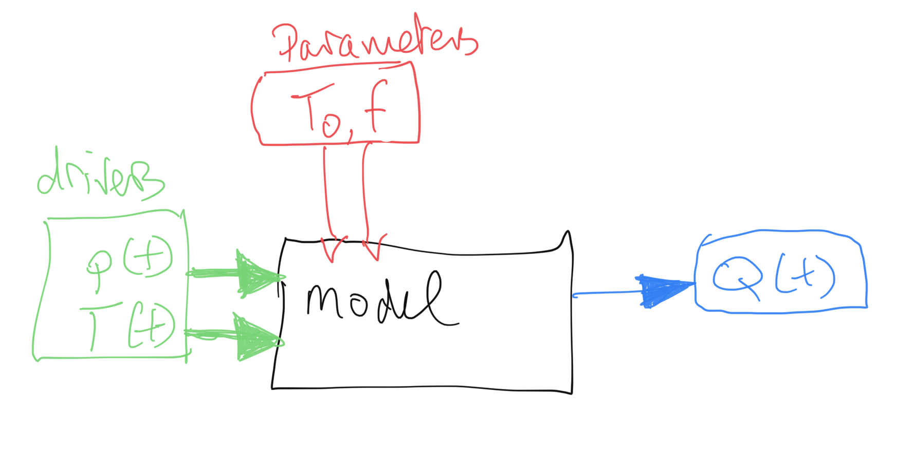
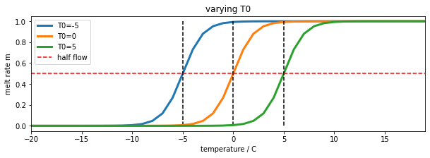
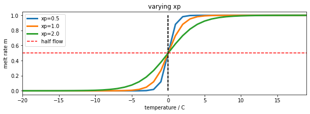
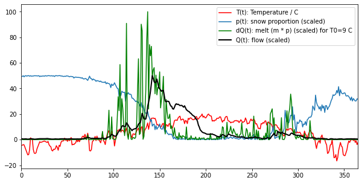
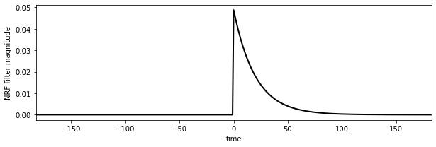
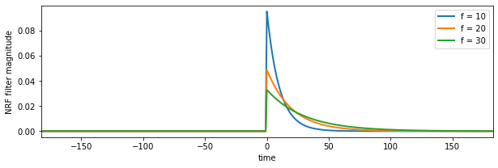
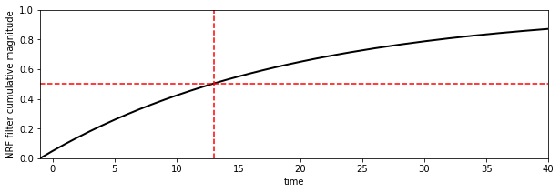
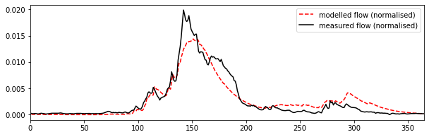

# Assessed Practical Part B


## Checklist and proportion of marks

        Part B: 10 Jan, 2022 (50% of final mark) - first day of term 2
    
* There are two parts to this:


    - Snow data preparation [40%]
    - Model inversion [60%]    
    
You should be submitting **a single PDF file** of codes that you develop **withing functions** in a single Jupyter notebook. Thius must cover:

    * Snow data preparation                         [40%]
    * Model inversion                               [60%]
    
* None of these sections should be more than a few pages long: we do not want you to print or submit the datasets you download.
* Look over the [requirements for data processing](#Structure-of-the-Report) and [modelling](#Structure-of-the-Report-(cal/val)) to make sure you have completed all parts.
* Make sure you read the advice on [computer codes and plagiarism](063_Part1_code.md)
* As in Part 1 of the coursework, you *must* show that your notebook code runs from beginning to end, so we should see notebook cells starting at `[1]` and  continuing sequentially. 
* Do **not** make use of global variables to pass information to a function: you should pass all information required by a function via arguments and/or keywords.
* Make sure codes have comments describing what you are doing and why (and, where relevant, what code you have based your code on)
* Make sure that all functions have clear and detailed documentation strings, describing the purpose, inputs, and outputs and any return values from the function. Think about what any user of the function would need to know to be able to use it. 
* You must submit a single pdf of notebook that contains code, graphics and other materials to fulfill the requirements of the two sections of work here. 
* Do not mix materials from the two sections. 
* Pay careful attention to [all of the required aspects of the submission](#Coursework).

## Introduction

### Task overview

In this task, we will use a simple computer model of catchment-scale hydrology by snowmelt, apply this to a catchment in the Rio Grande Headwaters, Colorado, USA, and use datasets we have generated to **calibrate and test** the model **using multi-year data**.

### The model and data

We use a two-parameter water balance model that describes stream flow at some some measurement station as a function of daily catchment snow cover and daily temperature. You are provided with code for this [model](geog0111/model.py) so you do not need to show this (you will get no marks for repeating that code). It assumes that the water (parameterised as snow water equivalent -- SWE) is stored in the snowpack and released as runoff when the temperature reaches some threshold. An exponential network response function (NRF) is used to model the routing of the snowmelt to water at the measurement station. You can compare the modelled stream flow (for given model parameters and driving data) with measurements to achieve the calibration and validation. 

The two parameters that control model behaviour describe: 

- the threshold temperature `T0`; 
- the delay `f` parameter of the NRF used in routing the water from snowmelt to river flow. 

We will estimate these for the catchment in a model calibration stage using data from 2018, and then validate them against independent data from the year 2019. 

You will need 3 datasets to run the model in this part of the coursework:

- `T` : temperature (C) at the Del Norte monitoring station for each day of the year
- `Q` : stream flow data for each in units of megalitres/day (ML/day i.e. units of 1000000 litres a day)
- `p` : Catchment snow cover (proportion)

You should already have the datasets `T` and `Q` for the years 2016-2019 inclusive, and will need to make use of the datasets for 2018 and 2019 in this work.

The datasets `p` and `T` will form the model driving data. We will use the stream flow observations `Q` to achieve model calibration and validation.

The first part of this submission then **(40% of marks)** involves deriving the snow snow cover data `p` from MODIS satellite data. 

The second part **(60%)** involves building a 2D parameter Look-up table (LUT) and using this to calibrate the two model parameters for the catchment for a given year. You will then test this calibration against data from another year.


We are happy to take any general questions about the requirements of the coursework via the [moodle channel](https://moodle.ucl.ac.uk/mod/forum/discuss.php?d=506910).

#### Submission

The due date for this second formally assessed piece of coursework is:

        Part B: 11th Jan, 2021 (50% of final mark) - first day of term 2

Recall that the whole of the practical work for this course comes in two parts : (A) [data preparation (50%)](Geog0111_Part1.pdf); (B) [modelling (50%)](Geog0111_Part2.pdf) 

Submission is through the usual Turnitin link on the [course Moodle page](https://moodle.ucl.ac.uk/course/view.php?id=21495). 

**You must submit your notebooks as a single `pdf` files.**


### Advice and degree of original work expected

You have been given information on the proportion of marks awarded for each section of the part B, above. 

When you do the coursework, you should first go through everything to make sure you know what is expected. There are two parts, so you will want to try to complete the first part soon, and use these data to move on to the second part. Your datasets will be slightly different to those we use in the various plots here, but they should show the same broad patterns. If your driving/observational data are very different, you will want to check how you have read and/or generated the datasets.

**Concentrate first on being able to complete all parts of the coursework.** You may then want to go over the work again and make refinements. For instance, you are required to perform the model calibration with data from 2018 and validate it with data from 2019. But you could, if you like and if you have time, try to use further years of data in the calibration and validation. If you *did that well and explained why you were doing it*, you could potentially gain additional marks in the modelling section by going beyond the basic work required. You could, for instance, show insight into the problems at hand by using such data to establish some concept of uncertainty in the model parameters, or use it to demonstrate the generality of the code you have written. These or similar ideas would be good **extra** things that you might wish to do on top of the core requirements to improve the code and/or experimentation you submit. **But** you should not try to do 'extras' of this sort **until** you have completed all of the basic requirements. Make sure you can do that first, then, revisit your work, looking to refine and improve it.

When you are planning the code you need to develop, you will notice that you need to generate a snow product dataset to be able to complete the modelling section of this work. So you should first concentrate on generating a version of that dataset. Following the approach we have taken in the notes, code you need to write to achieve that will involve generating a 3D dataset of snow cover from MODIS data (time, rows, columns over the catchment) and an appropriate weight mask, and using these to interpolate/smooth in time. We have developed codes in the class that do that very thing to the LAI dataset, so it should not be a very complicated task for you to modify those codes to achieve the interpolated 3D snow dataset. The rest of the first part then just involves processing that to get the mean snow cover per day over the catchment pixels. 

You *might* complete and pass that task by simply using existing codes taken from the `geog0111` codebase (the `modisUtils` codes in particular -- e.g. `geog0111.modisUtils.modisAnnual()` and `geog0111.regularise()`). You will still need to develop a fully documented and commented Python codes, but if you do *only use these codes that are supplied*, you will not have shown any great depth in your coding skills. For that reason, we will award **not higher that a pass** mark (i.e. 50% of the marks available for that part) for correctly running codes that do so. You can pick up *some marks* beyond a bare pass by having a beautifully organised and presented and documented Python codes in the coding section, but you will **only get much higher marks** in that section if you have developed some of your own codes below `geog0111.modisUtils.modisAnnual()` and `geog0111.regularise()`. We accept that even when you derive these codes, you will likely be making use of materials provided to you in the lectures up to a point. But since you should in any case have developed your own codes for these in the exercises and formative assessments, you should try to make use of your own codes, with your own comments, documentation and structure. Remember that [in any case you need to fully  acknowledge the source of any codes that you use](063_Part1_code. You will also find that many of the codes in `geog0111.modisUtils` have deliberately sparse documentation, so you can at the very least improve on these.

These same comments apply to other aspects of the coursework you submit. So, for example, whilst you *could* make use of wrapper codes we have written for plotting datasets, **we do not want you to do so**. Instead, we expect you to show us that you know how to use `matplotlib` to plot images and datasets. 

The coursework is designed in this way so that everyone taking this should be able to achieve a 'pass mark' for the course: to pass, you essentially need to organise existing codes to achieve the desired effect and provide sufficient documentation and commenting. You need to show you can develop Python functions, run codes in a notebook, and present results. If you can show that you can do that, then we will all have achieved the basic requirement for this course, and you will have demonstrated a base level of understanding of coding in Python. If you are not achieving the pass level in any one component of the course, you should still be able to achieve a pass overall by showing you skill and insight in some areas and achieving at least 50% overall.

But we very much hope that you will have a much better than 'basic' level of understanding now, and we want you to have the opportunity to demonstrate that deeper level of understanding. For this reason, there are plenty of opportunities in the submission for you to 'shine' and show us what you can achieve. 

As in Part 1 of the coursework, you *must* show that your notebook code runs from begining to end, so we should see notebook cells starting at `[1]` and  continuing sequentially. If you don't do that, you won't have demonstrated that your code works.

We are happy to take any general questions about the requirements of the coursework via the [moodle channel](https://moodle.ucl.ac.uk/mod/forum/discuss.php?d=506910).

##  Background to the problem

The hydrology of the Rio Grande Headwaters in Colorado, USA is snowmelt dominated. It varies considerably from year to year and may very further under a changing climate. One of the tools we use to understand monitor processes in such an area is a mathemetical ('environmental') model describing the main physical processes affecting hydrology in the catchment. Such a model could help understand current behaviour and allow some prediction about possible future scenarios. 

In this part of your assessment you will be developing datasets for, then using, calibrating and validating such a model that relates temperature and snow cover in the catchment to river flow. 


We will use the model to describe the streamflow at the Del Norte measurement station, just on the edge of the catchment. You will use environmental (temperature) data and snow cover observations to drive the model. You will perform calibration and testing by comparing model output with observed streamflow data.

### Del Norte

Further general information is available from various [websites](http://www.usclimatedata.com/climate.php?location=USCO0103), including [NOAA](http://www.ncdc.noaa.gov).


You can visualise the site Del Norte 2E  [here](http://mesonet.agron.iastate.edu/sites/site.php?station=CO2184&network=COCLIMATE).


## Previous work

In [part A](Geog0111_Part1.pdf), you should have developed datasets for four years, 2016-2019 inclusive for:

    * temperature (C) at the Del Norte monitoring station for each day of the year
    * stream flow data for each in units of megalitres/day (ML/day i.e. units of 1000000 litres a day)
    
as a function of day of year (`doy`).
    
**You will use years 2018 and 2019 of these datasets in part 2 of this work.**

If for some reason, you are unable to produce the datasets in [part A](Geog0111_Part1.pdf) you should contact one of the course convener to discuss what to do.


## The model

As we have noted, you will be running, calibrating and testing a snowmelt model in the Rio Grande Headwaters in Colorado, USA. 

The model has two parameters that control model behaviour: 

- the threshold temperature `T0` (C); 
- the delay `f` parameter (days) of the NRF used in routing the water from snowmelt to river flow. 

**We will estimate these for the catchment in a model calibration stage using data from 2018, and then validate them against independent data from the year 2019.**

You will need 3 datasets to run the model in this part of the coursework:

- `T` : temperature (C) at the Del Norte monitoring station for each day of the year
- `Q` : stream flow data for each in units of megalitres/day (ML/day i.e. units of 1000000 litres a day)
- `p` : Catchment snow cover (proportion)

You should already have the datasets `T` and `Q` for the years 2016-2019 inclusive, and will need to make use of the datasets for 2018 and 2019 in this work. In the first part of this submission we will deriving the snow snow cover data from MODIS satellite data. We will explain this below.

First, we should familiarise ourselves with the model. 

The datasets `p` and `T` will form the model driving data. We will use the stream flow observations `Q` to achieve model calibration and validation.





### Snow water equivalent

The model state is the snow water equivalent (SWE), the amount of water in the snowpack for the catchment. We assume the resevoir of water is directly proportional to snow cover `p`, so:

    SWE(t) ~= p
    
with a constant of proportionality relating to snow depth and density. The model SWE in the system at time `t` is a function of the SWE released from the snowpack and entering the system at time `t` and previous time steps.

In the model, we do not consider mechanisms of when the snow appears or disappears from any location or thinning/thickening of the snowpack. Rather, we use the snow cover as time `t` as a direct surrogate of the SWE at time `t`. 


### Water release

We need a mechanism in the model that converts from `SWE(t)` to `dQ(t)`, the water flowing in to the system from the snowpack at time `t`. We can consider this as:

    dQ(t) = k m SWE(t)

where `dQ(t)` is the amount of water flowing into the catchment at time `t`, `m` is a proportion of the snowpack assumed to melt at time `t`, and `k` a constant of proportionality.

We model the rate of release of water from the snowpack as a logistic function of temperature:

    m = expit(T-T0)
    
where `expit` the [logistic function](https://docs.scipy.org/doc/scipy/reference/generated/scipy.special.expit.html) that we have previously used in phenology modelling. This is a form of 'soft' switch between the two states (not melting, `m=0`, and melting `m=1`). If the temperature is very much less than the threshold `T0`, it will remain frozen. If it is very much greater than `T0`, there will be an amount proportionate to `SWE(t)` flowing into the system on day `t`. For a temperature of `T0`, `m` takes a value of 0.5:


```python
import numpy as np
import matplotlib.pyplot as plt
from scipy.special import expit

# temperature
T = np.arange(-20,20)
fig, axs = plt.subplots(1,1,figsize=(10,3))
axs.set_xlabel("temperature / C")
axs.set_ylabel("melt rate m")

for T0 in [-5,0,5]:
    m = expit(T-T0)
    axs.plot(T,m,label=f'T0={T0}',lw=3)
    axs.plot([T0,T0],[0,1],'k--')
    
axs.set_xlim(T[0],T[-1])
axs.plot(T,m*0+0.5,'r--',label='half flow')
axs.legend(loc='best')
axs.set_title('varying T0')
```


    Text(0.5, 1.0, 'varying T0')


    

    


The water release from the snow pack on day `t`, `dQ(t)`, is now proportional to `p m`, so is controlled by temperature and current snow cover. 

We can introduce another model parameter, `xp` to use with the logistic function:


    m = expit((T-T0)/xp)
    
The parameter, `xp` (C) increases the slope of the function at `T==T0` with increasing `xp`. So it can be used to modify the 'speed' of action of the soft switch. We will use a default value of `xp=1.0`. It is likely to have only a minor impact on the modelling results so we can use this assumed value of the parameter. By keeping this parameter at a fixed value, we can simplify the problem you need to solve to one involving two parameters.


```python
import numpy as np
import matplotlib.pyplot as plt
from scipy.special import expit

# temperature
T = np.arange(-20,20)
fig, axs = plt.subplots(1,1,figsize=(10,3))
axs.set_xlabel("temperature / C")
axs.set_ylabel("melt rate m")

T0 = -0.0

for xp in [0.5,1.0,2.0]:
    m = expit((T-T0)/xp)
    axs.plot(T,m,label=f'xp={xp}',lw=3)
    axs.plot([T0,T0],[0,1],'k--')
    
axs.set_xlim(T[0],T[-1])
axs.plot(T,m*0+0.5,'r--',label='half flow')
axs.legend(loc='best')
axs.set_title('varying xp')
```


    Text(0.5, 1.0, 'varying xp')


    

    


We now load some example datasets of temperature, snow cover and flow. You are *not* to use these in your submission. They are for illustration only.


```python
import pickle
import numpy as np
import matplotlib.pyplot as plt
'''
Load example data
'''
pkl_file = open('data/data2005.pkl', 'rb')
# note encoding='latin1' because pickle generated in python2
data = pickle.load(pkl_file, encoding='latin1')
pkl_file.close()

T = data['temp']

# we normalise the flow data by subtracting the base level and 
# making it sum to 1, you should do the same
# or you will need to supply a scaling factor

Q = data['flow'] - data['flow'].min()
Q /= Q.sum()

p = data['snowprop']
t = data['doy']
```

We plot the datasets, along with `dQ(t)` calculated for a given value of `T0`: 


```python
fig, axs = plt.subplots(1,1,figsize=(10,5))
T0 = 9
xp = 1.

m = expit((T-T0)/xp)
# m * p
dQ = m * p
# normalise dQ
dQ /= dQ.sum()

# arbitrary scaling on values 
# to illustrate the datasets
axs.plot(t,T,'r',label='T(t): Temperature / C')
axs.plot(t,50 * p,label='p(t): snow proportion (scaled)')
axs.plot(t,100 * dQ/dQ.max(),'g',label=f'dQ(t): melt (m * p) (scaled) for T0={T0} C')
axs.plot(t,50 * Q/Q.max(),'k',lw=2,label='Q(t): flow (scaled)')

axs.set_xlim(0,365)
axs.legend(loc='best')
```


    <matplotlib.legend.Legend at 0x7fc528ae8610>


    

    


In the figure, we see the melt water that corresponds to a `T0` of 9 degrees. It is remarkably similar to the flow data, but much noisier. We also see that it occurs some time before we see the water flow at the monitoring station. The reason for this is that there is a 'network delay' between the melt happening in thge snowpack and it reaching the monitoring station. This final component of our model is a network response function (NRF) that models this delay:


```python
# build the NRF filter
#
# use centred filter time 
# parameter f = 20.0 days

f = 20. # days

# filter length
nrf_x = (np.arange(p.size) - p.size//2)

# filter function
nrf = np.exp(-nrf_x/f)    
# 1-sided NRF filter
nrf[nrf_x<0] = 0
# normalise so sum to 1
nrf /= nrf.sum()

# plot
fig, axs = plt.subplots(1,1,figsize=(10,3))
axs.plot(nrf_x,nrf,'k',lw=2,label='flow (scaled)')
axs.set_xlim(-p.size/2,p.size/2)
axs.set_ylabel('NRF filter magnitude')
axs.set_xlabel('time')
```


    Text(0.5, 0, 'time')


    

    


```python
nrf_x = (np.arange(p.size) - p.size//2)
# plot
fig, axs = plt.subplots(1,1,figsize=(10,3))

for f in [10,20,30]:
   # filter length

    # filter function
    nrf = np.exp(-nrf_x/f)    
    # 1-sided NRF filter
    nrf[nrf_x<0] = 0
    # normalise so sum to 1
    nrf /= nrf.sum()
    axs.plot(nrf_x,nrf,lw=2,label=f'f = {f:d}')
    
axs.set_xlim(-p.size/2,p.size/2)
axs.set_ylabel('NRF filter magnitude')
axs.set_xlabel('time') 
plt.legend()
```


    <matplotlib.legend.Legend at 0x7fc4f8507090>


    

    


The NRF is effectively a one-sided smoothing filter. It imparts a delay on the signal `dQ`, and smooths it. 

If we look at the **cumulative effect** of the filter using `np.cumsum`, we can see how long it takes for the water to reach the monitoring station:


```python
fig, axs = plt.subplots(1,1,figsize=(10,3))
axs.plot(nrf_x,np.cumsum(nrf),'k',lw=2,label='flow (scaled)')
axs.set_xlim(-p.size/2,p.size/2)
axs.set_ylabel('NRF filter cumulative magnitude')
axs.set_xlabel('time')
axs.set_xlim(-1,40)
axs.set_ylim(0,1)
axs.plot([13,13],[0,1],'r--')
axs.plot([-1,40],[0.5,0.5],'r--')
```


    [<matplotlib.lines.Line2D at 0x7fc519e46150>]


    

    


According to this model, with this parameter (f = 20), about half of the melt water has reached the monitoring station after around 13 days. If we increase `f`, we increase the time lag.

If we convolve this filter with out signal `m p`, we have our complete model. It is a very simple model that has only 2 parameters: `T0` and `f`, although we have assumed the flow data to be normalised to sum to 1 to avoid an additional scaling factor.

We can now see the code for the model (also in [geog0111/model.py](geog0111/model.py)):


```python
from scipy.special import expit
import scipy
import scipy.ndimage.filters

def model(T0,f,T,p,xp=1.0):
    '''
    snow melt model by P. Lewis (C) UCL 2010-2022
    
    parameters:
        T0 - Temperature threshold (C): float or shape (Np)
             Typical range: 0.0 to 20.0 C
        f  - NRF filter decay rate (days) : float or shape (Np)
             Trypical range: 5 to 30 days
    Drivers:
        T  - Temperature (C)         : shape (Nd,)
        p  - snow cover (proportion) : shape (Nd,)
        
    Option:
        xp - float (C). Characteristic decay rate in Temperature function 
             typical range 0.25 to 1.0
    
    Output:
    
        Normalised river flow resulting from snowmelt. 
        Normalised to sum to 1.0 over all days
    '''
    # force T0 and f into 1D -> arrays
    f = np.array(f).ravel()[np.newaxis,:]
    T0 = np.array(T0).ravel()[np.newaxis,:]
    # treat T and p into 1D -> 2D arrays
    T = T.ravel()[:,np.newaxis]
    p = p.ravel()[:,np.newaxis]
    
    # logistic for temperature threshold effect
    y = p * expit((T-T0)/xp)
    
    # centred filter time 
    nrf_x = (np.arange(p.shape[0]) - p.shape[0]/2)
    # 1-sided NRF filter scaled by parameter f
    nrf = np.exp(-(nrf_x[:,np.newaxis]/f))
    nrf[nrf_x<0,:] = 0
    
    # modelled flow : loop is inefficent but 
    # necessary if using convolution routine
    Q_nrf = np.array([scipy.ndimage.filters.convolve1d(y[:,i], nrf[:,i]) \
                       for i in range(y.shape[1])]).T
    
    Q_nrf -= Q_nrf.min(axis=0)[np.newaxis,:]
    
    return Q_nrf/Q_nrf.sum(axis=0)
```

If we run the model and compare with out observations of `Q`:


```python
# Run the model
T0,f = 9,20
# T and p are input time series
Q_nrf = model(T0,f,T,p).ravel()

fig, axs = plt.subplots(1,1,figsize=(10,3))
axs.plot(t,Q_nrf,'r--',label=f'modelled flow (normalised)')
axs.plot(t,Q,'k',label='measured flow (normalised)')

axs.set_xlim(0,365)
axs.legend(loc='best')
```


    <matplotlib.legend.Legend at 0x7f5bb42445d0>


    

    


We can have a look at what the impact of changing the `xp` parameter is, and confirm that it is relatively minor:


```python
# Run the model
T0,f = 9,20

fig, axs = plt.subplots(1,1,figsize=(10,3))

for xp in [0.25,0.75,1.0]:
    Q_nrf = model(T0,f,T,p,xp=xp).ravel()
    axs.plot(t,Q_nrf,label=f'modelled flow: xp={xp}')

axs.plot(t,Q,'k',label='measured flow (normalised)')

axs.set_xlim(0,365)
axs.legend(loc='best')
```


    <matplotlib.legend.Legend at 0x7f5bb41b5e90>


    

    


So, `xp` has a small impact on peak flows, in effect by smoothing impact the temperature data for increasing `xp`. Other aspects of the model we might look at refining would be the filter shape, but we know that the main impact of the NRF is the width of the filter, rather than the precise shape. Notice that whilst tweaking minor parameters such as these may improve the model fit here slightly, it may well not generalise to other cases as well. Further, when we introduce another 'free' parameter in a model optimisation, we must recognise the impact of the degrees of freedom of the problem.

For the default value of `xp`, and the values of `T0` and `f` considered here then, the model appears to be capable of following the features of the measured flow data quite well, although it its slightly over-smoothed.

We have defined a simple snow melt model. It has two major parameters that we can vary:

* `T0`: the lower temperature threshold (C)
* `f`: the network response function decay factor (days)

The modelled flow is normalised so that the total flow equals the total measured flow. The base flow is subtracted from the data so that the minimum flow is zero.

## Coursework

There are two sections to part B of your coursework:
     
    - Snow data preparation [40%]
    - Model inversion [60%]    
    
You should be submitting a **single PDF file**, with two sections, covering:

    * Snow data preparation                         [40%]
    * Model inversion                               [60%]
    
    

## Snow data preparation `[40%]`

### Overview 

The aim of this section is for you to produce datasets of snow cover for the Hydrological Unit Code (HUC code)  catchment 13010001 (Rio Grande headwaters in Colorado, USA) using MODIS snow cover data. You should by now have plenty of experience of accessing and using the MODIS LAI product, and we have already come across the snow product in [030_NASA_MODIS_Earthdata](030_NASA_MODIS_Earthdata.md). 


### Requirements

#### `df = getSnowData(year)`

The code should include a function `df = getSnowData(year)` that takes as argument the year `year` in question and returns a Pandas dataframe or dictionary `df`. 

* When you run it for `year`, it must create and store a (gap-filled) measured snow cover dataset for that year, for each day of the year, averaged over over HUC catchment 13010001. 
* It should store the data in a CSV format file called `work/snow_cover_YYYY.csv` for year YYYY. 
* It should return a Pandas dataframe or dictionary `df` containing keys for day of year (`doy`) and catchment mean snow cover `p`. 

Further instructions:

* You must do the gap-filling for each pixel in the catchment along the time-axis. You must then take the average of the gap-filled data over the catchment.
* You must show the documentation help string `help(getSnowData)`
* Do **not** make use of global variables to pass information to a function: you should pass all information required by a function via arguments and/or keywords. 

To demonstrate operation, you must:

* Run your `getSnowData` code for both 2018 and 2019
* Show the size and dates of the files created. 
* For each year, plot graphs showing and the snow cover datasets you have generated, **alongside the data for `T` and `Q` that you generated in part A**.
* You must develop this code in Jupyter notebook cells. 

Pay attention to the quality of the plots you produce, as well as the comments, doc strings and style of your codes. Neither of the PDFs should be more than a few pages long.


### Advice

You will need this snow cover dataset, along with those you generated in Part A of your coursework
You will want to use the product `MOD10A1` for the years 2018 and 2019. You should apply the catchment boundary vector dataset in the file [data/Hydrologic_Units/HUC_Polygons.shp](data/Hydrologic_Units/HUC_Polygons.shp) to clip your region of interest, specifying the warp arguments and other parameters as follows:

        sds     = ['NDSI_Snow_Cover']
        product = 'MOD10A1'
        tile = ['h09v05']
        
        warp_args = {
          'dstNodata'     : 255,
          'format'        : 'MEM',
          'cropToCutline' : True,
          'cutlineWhere'  : f"HUC=13010001",
          'cutlineDSName' : 'data/Hydrologic_Units/HUC_Polygons.shp'
        }

You **can** the use a high-level function such as [`modisAnnual`](geog0111/modisUtils.py) as previously to gather the dataset for the two years of interest, but note that if you do, the marks you get for that part of the code development will be limited to a pass grade. You can get more marks by developing, documenting and commenting your own codes for the MODIS processing. 

That said, the first time you go through the coursework, we recommend you *do* use a high-level function such as this to make sure that you can complete this part of the coursework. If can later return and develop your own code, in which case you will have a previous result you can check yours against. You should *not* 

Since the function [`modisAnnual`](geog0111/modisUtils.py) is able to cache the dataset, you might like to run it the first time from a shell, with the verbose flag switched on. It may take some considerable time to stitch all of the data together, so being able to see the progress from the verbose output will be important (set the `verbose` flag in the kwargs).

Note the comments above on developing your own codes for reading and processing the MODIS data: you can use the codes that we provide, and you *should* use these the first time you go through the work. But, you will get more credit for codes that show more coding skills that just calling these high level codes. **You should only submit one version of the codes you develop**.

You will use one year for model calibration and the other for model validation. As the dataset may have gaps, you should use the regularisation approach we have taken previously for LAI to fill the gaps. 

The dataset you produce for each year should have 365 days of snow cover data. It should broadly look like the example shown above. If your dataset appears too 'spikey', it may well be that you have forgotten to apply the regularisation/gap filling.

You might find additional visualisations of interest, such as the space-time plots we did for the LAI time series visualisations.

## Model inversion `[60%]`

### Overview 

You should have access to datasets for

- `T` : temperature (C) at the Del Norte monitoring station for each day of the year
- `Q` : stream flow data for each in units of megalitres/day (ML/day i.e. units of 1000000 litres a day)
- `p` : Catchment snow cover (proportion)

for the years 2018 and 2019. These should be stored in files `work/snow_cover_YYYY.csv` (and similar) for year YYYY. 

If, for any reason you have been able to produce these, discuss the matter with your course tutors before completing this section. **You must NOT simply use the datasets provided with the notes without consultation**.

### Requirements (cal/val)

#### `calibration = calibrate(year)` 

* For the model inversion part of the coursework, write a function called `calibration = calibrate(year)` to use a LUT approach to calibrate the 2-parameter snowmelt model presented above for a given year of data 
* It should read the driving datasets (`T`, `Q`, `p`) from their CSV files for `year`, performing any necessary filtering or gap-filling (e.g. replace `NaN` values).
* It should output a dictionary or Pandas `df` containing the model parameters and the goodness of fit metric at the LUT minimum in `calibration`, along with appropriate datasets that you can use to visualise and verify the calibration results. 

#### `result = validate(year,calibration)`
* Write a function called `result = validate(year,calibration)` 
* It should read the driving datasets (`T`, `Q`, `p`) from their CSV files for `year`, and perform any necessary filtering or gap-filling (e.g. replace `NaN` values).
* It should take as argument the calibrated model parameters (contained in `calibration`) and validate the model.
* The main output `result`, a dictionary or Pandas `df`, will contain the goodness of fit metric achieved in validation and other appropriate datasets that you can use to visualise the validation results.

To demonstrate operation, you must:

* In a Jupyter notebook cell, run the model calibration for a given year of data, returning `calibration`, then from `calibration`, print a table of the calibration parameters and associated statistics. 
* produce visualisations of the calibration results along with a paragraph of text describing what you are showing. 
* Use the other year of data to validate the model using the information in `calibration`, i.e. run the model for the second year with the parameters you derived from the first (calibration) year. 
* produce visualisations of the validation results, along with a paragraph of text describing the validation results. 


### Advice

Given that you will need to do any filtering or gap-filling (e.g. replace `NaN` values) of your input data for both functions, you might consider using a sub-function that reads and processes the data.

You should plan your LUT inversion code carefully, thinking about what inputs and outputs you need. Test the code carefully at each stage of development. Use a debugger to step through it line-by-line if you need to. Make your code generic so that it will run no matter what year you specify (provided the dataset exists). Think about error checking in the code.

The outputs of the function `calibrate()` should obviously include the model parameters that you have solved for and the goodness of fit metric. But it should also contain information that will allow you to produce visualisations of the result. Useful visualisations could include: error surface plots (to confirm the solution); and time series plots of the modelled and measured flow data (along with temperature and snow cover for context) to show how well the model and measured datasets match. Scatterplots may also be of value.

The inputs of `validate()` will be similar to `calibrate()` but will include the model parameters as well. Useful visualisations could include time series plots of the modelled and measured flow data (along with temperature and snow cover for context) to show how well the model and measured datasets match. Scatterplots may also be of value. Plots comparing the driving data for the two years may be interesting.

We recognise that this task is technically slight harder than the dataset preparation, which is why it has a higher weight. To be able to achieve a pass mark in the code in this section, we will be looking for codes that work (or nearly work) and that have a basic level of documentation and comments. If for some reason your code doesn't fully work, then you should demonstrate the aspects of it that do work as intended. You can get higher marks for better code, with better design and style. But you must have the basic code operating before we can take account of such second order effects, so again, make sure you get code that achieves the main task before you spend too much time of refining it.

For the visualisations, we will be looking for a basic set of visualisations of the results (time series and error surface) for you to get pass marks. Clarity and refinement shown in the data visualisations can get you extra marks.

If you have completed all of the work and produced elegant code and visualisations and you still want to do more, you could consider some of the extras we discuss above, such as running the calibration/validation for additional years of data, or perhaps even testing the calibration for varying some aspects of the model that are currently 'fixed', such as the `xp` parameter or the filter shape. There may be other interesting things you could consider as well. If you have completed the core requirements, then you can get extra marks for the skill you show in any extra work (up to the limits of the marks awarded for each section).

You need to submit you coursework in the usual manner by the usual submission date.

You **must** work individually on this task. If you do not, it will be treated as plagiarism. By reading these instructions for this exercise, we assume that you are aware of the UCL rules on plagiarism. You can find more information on this matter in your student handbook. If in doubt about what might constitute plagiarism, ask one of the course conveners. You should read the [advice on plagiarism and computer codes](063_Part1_code.md) we have supplied.

#### Word limit

There is no word limit *per se* on the computer codes, though as with all writing, you should try to be succinct rather than overly verbose. None of these sections should be more than a few pages long: we do not want you to print or submit the datasets you download. **You will be marked down if your submission is not clear**.

#### Code style

A good to excellent piece of code would take into account issues raised in the [style guide](http://www.python.org/dev/peps/pep-0008/). The ‘degree of excellence’ would depend on how well you take those points on board.
